# 第四章 漏洞发现

> 作者：Gilberto Najera-Gutierrez

> 译者：[飞龙](https://github.com/)

> 协议：[CC BY-NC-SA 4.0](http://creativecommons.org/licenses/by-nc-sa/4.0/)

## 简介

我们现在已经完成了渗透测试的侦查阶段，并且识别了应用所使用的服务器和开发框架的类型，以及一些可能的弱点。现在是实际测试应用以及检测它的漏洞的时候了。

这一章中，我们会涉及到检测一些 Web 应用中常见漏洞的过程，以及允许我们发现和利用它们的工具。

我们也会用到 vulnerable_vm 中的应用，我们会使用 OWASP Mantra 作为浏览来执行这些测试。

## 4.1 使用 Hackbar 插件来简化参数分析

在测试 Web 应用时，我们需要和浏览器的地址栏交互，添加或修改参数，以及修改 URL。一些服务器的相应会包含重定向，刷新以及参数修改。所有这些改动都会使对相同变量尝试不同值的操作非常费时间。我们需要一些工具来使它们不那么混乱。

Hackbar 是 Firefox 插件，它的行为就像地址栏，但是不受由服务器响应造成的重定向或其它修改影响，这就是我们需要测试 Web 应用的原因。

这个秘籍中，我们会使用 Hackbar 来简化相同请求的不同版本的发送工作。

### 准备

如果你没有使用  OWASP Mantra，你需要在你的 Firefox 上安装 Hackbar。

### 操作步骤

1.  访问 DVWA 并且登录。默认的用户名/密码组合是`admin/admin`。

2.  在左侧的菜单上选择`SQL Injection`（SQL 注入）。

    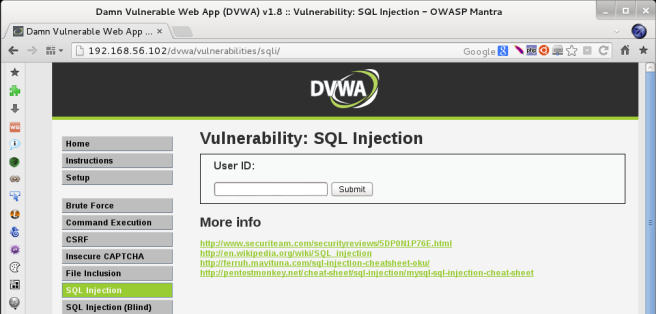
    
3.  在` User ID `输入框中输入数字，并点击`Submit`（提交）。

    现在我们可以按下`F9`或者点击图标来显示 Hackbar。
    
    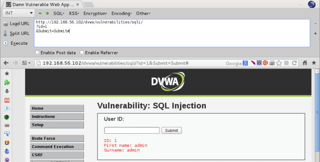
    
    Hackbar 会赋值 URL 及其参数。我们也可以开启修改 POST 请求和 Referer 参数的选项。后者告诉服务器页面从哪里被请求。
    
4.  让我们做个简单的改动，将`id`参数值从`1`改成`2`，并点击`Execute`（执行）或者使用` Alt + X`快捷键。

    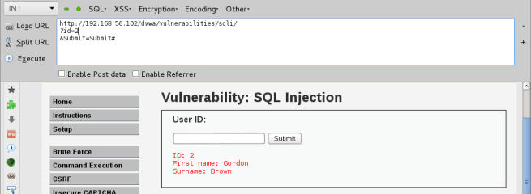
    
    我们可以看到，参数`id`对应页面上的文本框，所以，我们可以使用 Hackbar 修改`id`来尝试任何值，而不需要修改文本框中的`User ID`并提交它。在测试拥有许多输入的表单，或者取决于输入重定向到其它页面的表单时，这非常便利。
    
5.  我们可以将一个有效值替换为另一个，但是如果我们输入了一个无效值作为`id`，会发生什么呢？尝试将单引号作为`id`：

    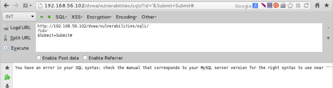
    
    通过输入应用非预期的字符，我们触发了一个错误，这在之后测试一些漏洞的时候非常有用。
    
### 工作原理

Hackbar 是带有一些实用特性的第二个地址栏，比如不受 URL 重定向影响，并且允许我们修改 POST 参数。

此外，Hackbar 可用于向我们的请求中添加 SQL 注入或跨站脚本代码段，以及哈希、加密和编码我们的输入。我们会在这一章后面的秘籍中深入探索 SQL 注入、跨站脚本，以及其他漏洞。

## 4.2 使用 Tamper Data 插件拦截或修改请求

有时候，应用拥有客户端的输入校验机制，它们通过 JavaScript，隐藏表单或者 POST 数据，并不能直接在地址栏中了解或看到。为了测试这些以及其它类型的变量，我们需要拦截浏览器发送的请求并且在它们到达服务器之前修改它们。这个秘籍中，我们会使用叫做 Tamper Data 的 Firefox 插件来拦截表单提交并且在它离开计算机之前修改一些值。

### 操作步骤

1.  从 Mantra 的菜单中访问 `Tools | Application Auditing | Tamper Data`。

    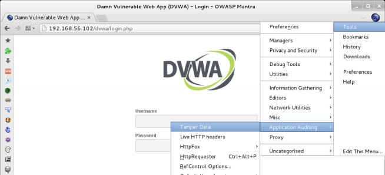
    
2.  会出现 Tamper Data 的窗口。现在，让我们浏览 < http://192.168.56.102/dvwa/login.php>。我们可以在插件中看到请求会话。

    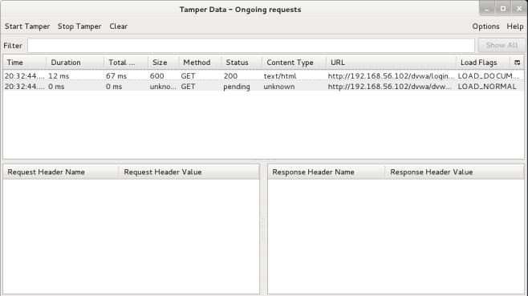
    
    > 每个浏览器产生的请求都会在活动时经过 Tamper Data。
    
3.  为了拦截请求并修改它的值，我们需要通过点击`Start  Tamper`来启动 Tamper。现在启动 Tamper。

4.  输入一些伪造的用户名密码组合。例如，` test/password`，之后点击`Login`。

5.  在确认框中，取消勾选` Continue Tampering?`并点击`Tamper`。`Tamper Popup`窗口会出现。

6.  在弹出窗口中，我们可以修改发送给服务器的信息，包括请求头和 POST 参数。将`username`和`password`改为正确的（`admin/admin`），之后点击`OK`。这应该在本书中使用，而不是 DVWA：

    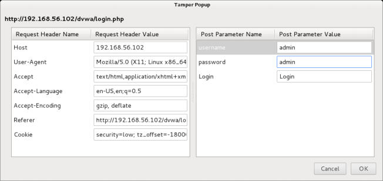
    
    在最后一步中，我们在表单中的值由浏览器发送给服务器之前修改了它们。因此，我们可以以正确的凭证而不是错误的凭证登录服务器。
    
### 工作原理

Tamper Data 会在请求离开浏览器之前捕获请求，并提供给我们时间来修改它包含的任何变量。但是，它也有一些限制，例如不能编辑 URL 或 GET 参数。

## 4.3 使用 ZAP 来查看和修改请求

虽然 Tamper Data 有助于测试过程，有时我们需要更灵活的方法来修改请求以及更多特性，例如修改用于发送它们的方法（即从 GET 改为 POST），或者使用其它工具为进一步的目的保存请求/响应对。

OWASP ZAP 不仅仅是 Web 代码，它不仅仅能够拦截流量，也拥有许多在上一章所使用的，类似于爬虫的特性，还有漏洞扫描器，模糊测试器，爆破器，以及其它。它也拥有脚本引擎，可以用于自动化操作或者创建新的功能。

这个秘籍中，我们会开始将 OWASP ZAP 用作代理，拦截请求，并在修改一些值之后将它发送给服务器。

### 准备

启动 ZAP 并配置浏览器在通过它发送信息。

### 操作步骤

1.  访问 <http://192.168.56.102/mutillidae/>。

2.  现在，访问菜单栏中的`OWASP Top 10 | A1 – SQL Injection | SQLi – Extract Data | User Info`。

3.  下一步是提升应用的安全等级。点击` Toggle Security`。现在`Security Level`应该是` 1 (Arrogant)`。

4.  将`test'`（包含单引号）作为`Name`，以及` password'`作为`Password`，并且点击` View Account Details`。

    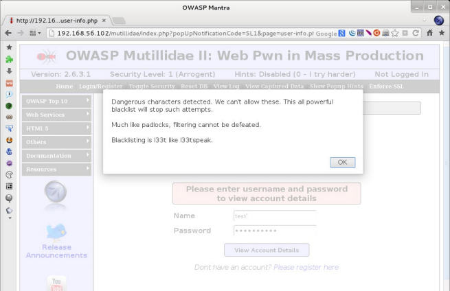

    我们得到了警告消息，告诉我们输入中的一些字符不合法。这里，单引号被检测到了，并被应用的安全手段中止。
    
5.  点击`OK`来关闭警告。

    如果我们在 ZAP 中检查历史，我们可以看到没有发给服务器的请求，这是由于客户端校验机制。我们会使用请求拦截来绕过这个保护。
    
6.  现在我们开启请求拦截（在 ZAP 叫做断点），通过点击`"break on all requests`（中断所有请求）按钮。

    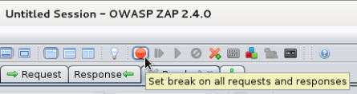
    
7.  下面，我们输入了有效值`Name`和`Password`，就像`test`和`password`，并再次检查细节。

    ZAP 会转移焦点，并打开叫做`Break`的新标签页。这里是刚刚在页面上产生的请求，我们可以看到一个 GET 请求，带有在 URL 中发送的`username`和`password`参数。我们可以添加上一次尝试中不允许的单引号。
    
    
    
8.  为了继续而不会被 ZAP 打断，我们通过点击`Unset Break`按钮来禁用断点。

    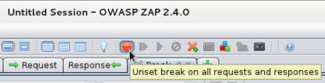
    
9.  通过播放按钮来提交修改后的请求。

    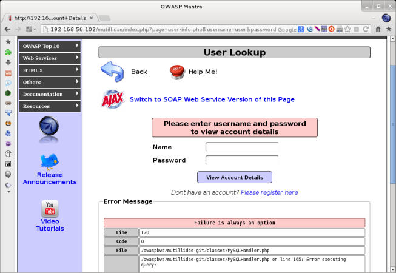
    
    我们可以看到，应用在顶部提供给我们错误信息，所以这是它的保护机制，它在客户端检查用户输入，但是在服务端并没有准备好处理非预期的请求。
    
### 工作原理

这个秘籍中，我们使用 ZAP 代理来拦截有效的请求，将它修改为无效或而已请求，之后把它发给服务器并且触发非预期的行为。

前三步用于开启安全保护，便于应用可以将单引号检测为无效字符。

之后，我们产生测试请求，并证实了会执行一些校验。提示警告的时候，没有请求通过代理，这告诉了我们检验是在客户端进行的，可能使用 JavaScript。知道了这个之后，我们产生了合法的请求，并使用代理来拦截它，这让我们能够绕过客户端的保护。我们将该请求转换为恶意请求，并把它发给服务器，这使它不能被正确处理，并返回错误。

## 4.4 使用  Burp Suite 查看和修改请求

Burp Suite 和 OWASP ZAP 一样，也不仅仅是个简单的 Web 代理。它是功能完整的 Web 应用测试包。它拥有代理、请求重放器、请求自动化工具、字符串编码器和解码器，漏洞扫描器（Pro 版本中），以及其它实用的功能。

这个秘籍中，我们会执行上一个练习，但是这次使用 Burp Suite 的代理功能来拦截和修改请求。

### 准备

启动 Burp Suite 并让浏览器使用它的代理。

### 操作步骤

1.  浏览 <http://192.168.56.102/mutillidae/>。

2.  默认情况下，Burp 代理中的拦截器是开着的，所以他会捕获第一个请求。我们需要打开  Burp Suite 并点击` Proxy `标签页中的`Intercept is on`按钮。

    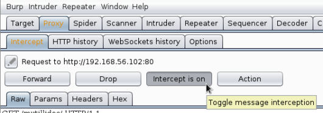
    
3.  浏览器会继续加载页面。当它完成时，我们通过` Toggle Security `将当前的应用安全级别设置为` 1 (Arrogant)`。

4.  从菜单栏中访问` OWASP Top 10 | A1 – SQL Injection | SQLi – Extract Data | User Info`。

5.  在`Name`输入框中，对`Username`输入`user<>`（包括符号）。在`Password`输入框中，对`Password`输入`secret<> `。之后点击`View Account Details`。

    我们会得到警告，告诉我们我们可能向应用输入了一些危险字
符。

6.  现在我们直到这些符号在表单中并不允许，我们也知道了它是客户端的校验，因为代理的` HTTP history `标签页中没有任何请求出现。让我们尝试绕过这个保护。通过点击 Burp Suite 中的`Intercept is off`来开启消息拦截。

    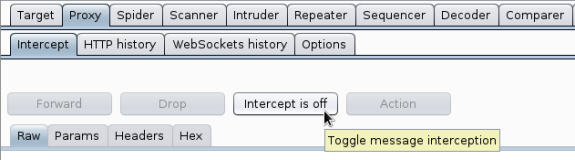
    
7.  下一步是发送有效数据，例如`user`和`secret`。

8.  代理会拦截该请求。现在我们修改`username`和`password`的值，通过添加禁止的字符`<>`。

    
    
9.  我们可以发送编辑后的信息，并通过点击` Intercept is on`来禁用拦截，或者我们可能发酸发送他并保持消息拦截，通过点击`Forward`。对于这个练习，我们禁用拦截并检查结果。

    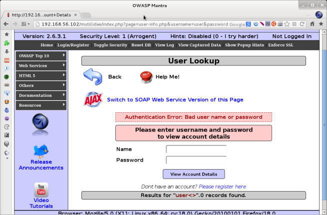

### 工作原理

就像在上个秘籍中看到的那样，在请求经过由应用建立在客户端的验证机制之前，我们使用代理来捕获请求，并通过添加一些在检验中不允许的字符，修改了它的内容。

能够拦截和修改请求，对任何 Web 应用渗透测试来说都非常重要，不仅仅用于绕过一些客户端检验，就像我们在当前和上一个秘籍中所做的那样，也能够用于了解发送了哪个信息，以及尝试理解应用的内部原理。我们可能也需要基于我们的理解来添加、移除或替换一些值。

## 4.5 识别跨站脚本（XSS）漏洞

跨站脚本（XSS）是 Web 应用中最常见的漏洞之一。实际上，它位于 2013 年 OWASP Top 10 的第三名（<https://www.owasp.org/ index.php/Top_10_2013-Top_10>）。

这个秘籍中，我们会看到一些识别 Web 应用中跨站脚本漏洞的关键点。

### 操作步骤

1.  登录 DVWA 并访问反射型 XSS。

2.  测试漏洞的第一步是观察应用的正常响应。在文本框中输入名称并点击`Submit`按钮。我们使用`Bob`。

    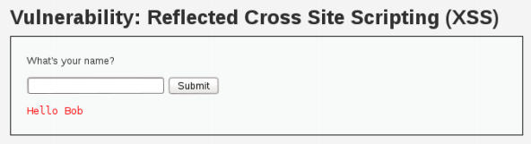
    
3.  应用会使用我们提供的名称来拼接代码。如果我们不输入有效名称，而是输入一些特殊字符或数字会怎么样呢？让我们尝试`<'this is the 1st test'>`。

    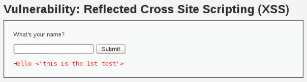
    
4.  现在我们可以看到，我们输入在文本框汇总的任何东西都会反射到响应中，也就是说，它成为了响应中 HTML 页面的一部分。让我们检查页面源代码来分析它如何展示信息，就像下面截图中那样：

    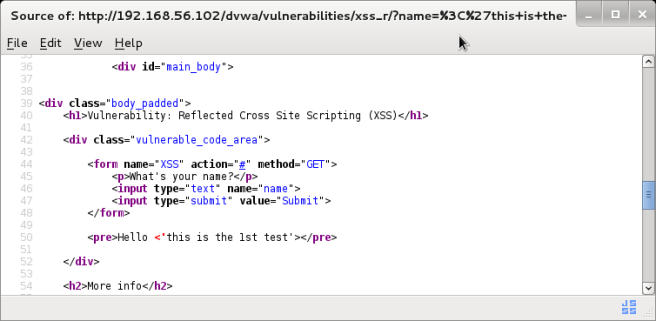

    源码表明了输出中没有对任何特殊字符做编码。我们发送的特殊字符被反射回了页面，没有任何预处理。`<`和`>`符号适用于定义 HTML 标签的符号，我们可能能够在这里输入一些脚本代码。
    
5.  尝试输入一个名称，后面带有非常简单的脚本代码。

    ```
    Bob<script>alert('XSS')</script>
    ```
    
    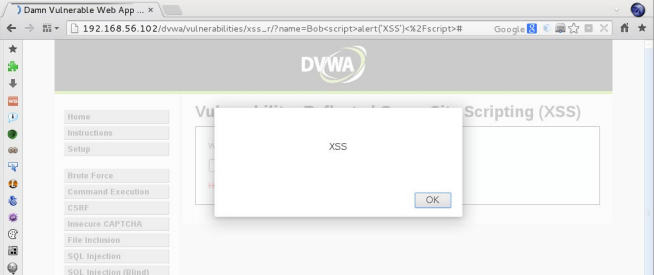
    
    页面会执行脚本，并弹出提示框，表明这个页面上存在跨站脚本漏洞。
    
6.  现在检查源码来观察输入中发生了什么。

    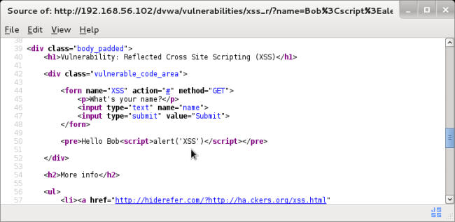
    
    我们的输入看起来作为 HTML 的一部分来处理。浏览器解释了`<script>`标签并执行了其中的代码，弹出了我们设置的提示框。
    
### 工作原理

跨站脚本漏洞在服务端和客户端中没有输入校验，并且输出没有合理编码时发生。这意味着应用允许我们输入用于 HTML 代码中的字符。一旦它被决定发送到页面中，并没有执行任何编码措施（例如使用 HTML 转义代码`&lt` 和 `&gt;`）来防止他们被解释为源代码。

这些漏洞可被攻击者利用来改变客户端的页面行为，并欺骗用户来执行它们不知道的操作，或偷取隐私信息。

为了发现 XSS 漏洞，我们需要遵循以下原则：

+   我们在输入框中输入的，准确来说是被发送的文本，用于形成在页面中展示的信息，这是反射型漏洞。

+   特殊的字符没有编码或转义。

+   源代码表明，我们的输入被集成到某个位置，其中它变成了 HTML 代码的一部分，并且会被浏览器解释。

### 更多

这个秘籍中，我们发现了反射型 XSS，也就是说这个脚本在每次我们发送请求时，并且服务器响应我们的恶意请求时都会执行。有另外一种 XSS 类型叫做“存储型”。存储型 XSS 可能会在输入提交之后立即展示，也可能不会。但是这种输入会储存在服务器（也可能是数据库）中，它会在用户每次访问储存数据时执行。

## 4.6 基于错误的 SQL 注入识别

注入在 OWASP top 10 列表中位列第一。这包含，我们会在这个秘籍中测试的漏洞：SQL 注入（SQLI），以及其它。

多数现代 Web 应用实现了某种类型的数据库，要么本地要么远程。SQL 是最流行的语言，在 SQLI 攻击中，攻击者向表单输入或请求中的其它参数注入 SQL 命令，使应用发送修改后的请求，来试图不正当使用应用和数据库通信。其中请求用于构建服务器中的 SQL 语句。

这个秘籍中，我们会测试 Web 应用的输入，来观察是否含有 SQL注入漏洞。

### 操作步骤

登录 DWVA 并执行下列步骤：

1.  访问` SQL Injection`。

2.  类似于上一章，我们通过输入数字来测试应用的正常行为。将`User ID`设置为1，并点击`Submit`。

    我们可以通过解释结果来得出，应用首先查询数据库，是否有 ID 等于 1 的用户，之后返回结果。
    
3.  下面，我们必须测试，如果我们发送一些应用的非预期结果，会发生什么。在输入框中输入`1'`并提交该 ID。

    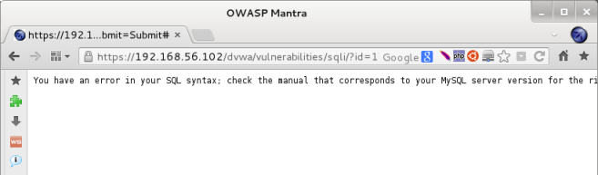

    这个错误信息告诉我们，我们修改了生成好的查询。这并不意味着这里确实有 SQL 注入，但是我们可以更进一步。

4.  返回 DWVA/SQL 注入页面。

5.  为了验证是否有基于错误的 SQL 输入，我们尝试另一个输入：`1''`（两个单引号）。

    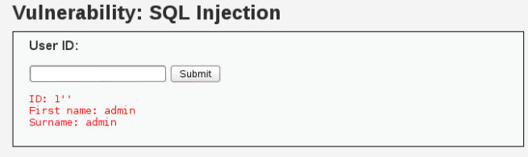


6.  现在，我们要执行基本的 SQL 注入攻击，在输入框中输入`' or '1'='1`并提交。

    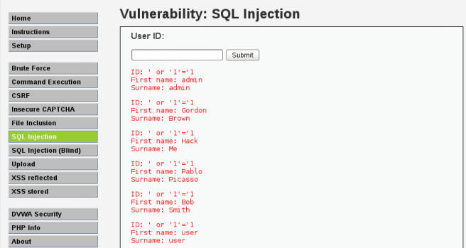
    
    看起来我们获取了所有数据库中的注册用户。

### 工作原理

SQL 注入发生在输入在用于组成数据库查询之前没有校验的时候。让我们假设服务端的代码（PHP）拼装了一个请求，例如：

```php
$query = "SELECT * FROM users WHERE id='".$_GET['id']. "'";
```

这意味着，`id`参数中发送的数据会被集成进来，因为它在查询里面。将参数的引用替换为它的值，我们能得到：

```php
$query = "SELECT * FROM users WHERE id='"."1". "'";
```

所以，当我们发送恶意输入，就像之前那样，代码行会由 PHP 解释器读取，就像：

```php
$query = "SELECT * FROM users WHERE id='"."' or '1'='1"."'";
```

拼接为：

```php
$query = "SELECT * FROM users WHERE id='' or '1'='1'";
```

这意味着“选择`users`表中的任何条目，只要用户`id`等于空或者 1 等于 1”。然而 1 永远等于 1，这就意味着所有用户都复合条件。我们发送的第一个引号闭合了原始代码中的做引号，之后我们输入了一些 SQL 代码，不带有闭合的单引号，而是使用已经在服务端代码中该设置好的单引号。

### 更多

SQL 攻击比起显式应用的用户名，可能导致更严重的破坏。通过利用这些漏洞，攻击者可能会通过执行命令和提权来控制整个服务器。它也能够提取数据库中的所有信息，包括系统用户名称和密码。取决于服务器和内部网络的配置，SQL 注入漏洞可能是整个网络和内部设施入侵的入口。

## 4.7 识别 SQL 盲注

我们已经看到了 SQL 注入漏洞如何工作。这个秘籍中，我们会涉及到相同类型漏洞的不同变体，它不显式任何能够引导我们利用的错误信息或提示。我们会学习如何识别 SQL 盲注。

### 操作步骤

1.  登录 DVWA 并访问`SQL Injection (Blind)`。

2.  它看起来像是我们上一章了解的 SQL 注入。在输入框中输入`1`并点击`Submit`。

3.  现在我们首次测试`1'`。

    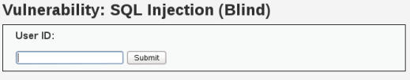
    
    我们没有得到任何错误信息，但是也没有结果，这里可能会发生一些有趣的事情。
    
4.  我们第二次测试`1''`。

    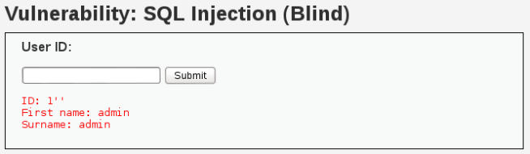
    
    `ID=1`的结果显示了，这意味着上一个结果`1'`产生了错误，并被应用捕获和处理掉了。很可能这里有个 SQL 注入漏洞，但是它是盲注，没有显示关于数据库的信息，所以我们需要猜测。
    
5.  让我们尝试识别，当用户注入永远为假的代码会发生什么。将` 1' and '1'='2 `设置为用户的 ID。
    
    `'1'`永远不会等于`'2'`，所以没有任何记录符合查询中的条件，并且没有人恶化结果。

6.  现在，尝试当 ID 存在时永远为真的请求：` 1' and '1'='1`。

    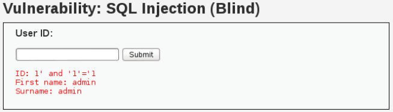
    
    这演示了页面上的盲注。如果我们的永远为假的 SQL 注入得到了不同的响应，并且永远为真的结果得到了另一个响应，这里就存在漏洞，因为服务器会执行代码，即使它不显示在响应中。
    
### 工作原理

基于错误的 SQL 输入和盲注都存在于服务端，也就是漏洞的那一段。应用在使用输入生成数据库查询之前并不过滤输入。二者的不同存在于检测和利用上。

在基于错误的 SQL 注入中，我们使用由服务器发送的错误来识别查询类型，表和列的名称。

另一方面，当我们视图利用盲注时，我们需要通过问问题来得到信息。例如，` "' and name like 'a%"`的意思是，“是否存在以`'a'`开头的用户？”如果我们得到了负面响应，我们会询问是否有以`'b'`开头的名称。在得到正面结果之后，我们会就会移动到第二个字符：`"' and name like 'ba%"`。所以我们会花费很多时间来检测和利用。

### 另见

下面的信息可能有助于更好的了解 SQL 盲注：

+   https://www.owasp.org/index.php/Blind_SQL_Injection 
+   https://www.exploit-db.com/papers/13696/ 
+   https://www.sans.org/reading-room/whitepapers/securecode/sqlinjection-modes-attack-defence-matters-23

## 4.8 识别 Cookie 中的漏洞

Cookie 是从网站发送的小型数据片段，它储存于用户的浏览器中。它们包含有关于这种浏览器或一些特定 Web 应用用户的信息。在现代 Web 应用汇总，Cookie 用于跟踪用户的会话。通过在服务端和客户端保存 Session ID，服务器能够同时识别由不同客户端产生的不同请求。当任何请求发送到服务器的时候，浏览器添加 Cookie并之后发送请求，服务器可以基于这个 COokie 来识别会话。

这个秘籍中，我们会学到如何识别一些漏洞，它们允许攻击者劫持有效用户的会话。

### 操作步骤

1.  访问 <http://192.168.56.102/mutillidae/>。

2.  打开 Cookie Manager+ 并且删除所有 Cookie。这可以防止与之前的 Cookie 产生混乱。

3.  现在，在 Mutillidae II中，访问`OWASP Top 10 | A3 – Broken Authentication and Session Management | Cookies`。

4.  在`Cookies Manager+ `中，我们会看到出现了两个新的 Cookie。`PHPSESSID `和`showhints`。选项前者并点击`Edit`来查看所有参数。

    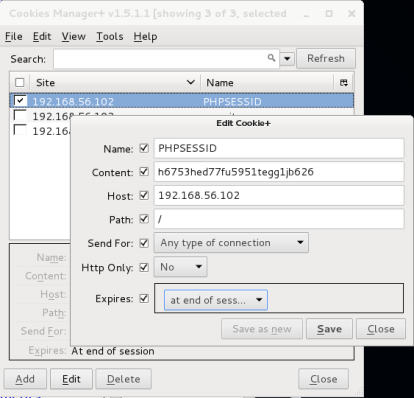
    
    `PHPSESSID `是基于 PHP 的 Web 应用的会话默认名称。通过查看 Cookie 中参数值，我们可以看到它可以经过安全和不安全的频道（HTTP 和 HTTPS）发送。同样，它可以被服务器读取，以及被客户端用过脚本代码读取，因为它并没有开启 HTTPOnly 标识。这就是说，这个应用的会话可以被劫持。
    
### 工作原理

这个秘籍中，我们检查了 Cookie 的某些之，虽然并不像上一个那么明显。在每次渗透测试中检查 Cookie 的配置非常重要，不正确的会话 Cookie 设置会打开会话劫持攻击的大门，以及错误使用受信任的用户账户。

如果 Cookie 没开启`HTTPOnly`标识，他就可以被脚本读取。因此，如果存在跨站脚本攻击漏洞，攻击者就能够得到有效会话的 ID，并且使用它来模拟应用中的真实用户。

Cookies Manager+ 中的安全属性，或者`Send For Encrypted Connections Only`选项告诉浏览器只通过加密的频道发送或接受该 Cookie（也就是说，只通过 HTTPS）。如果这个标志没有设置，攻击者可以执行中间人攻击（MITM），并且通过 HTTP 来得到会话 Cookie，这会使它显示为纯文本，因为 HTTP 是个纯文本的协议。这就再次产生了攻击者能够通过持有会话 ID 来模拟有效用户的场景。

### 更多

就像`PHPSESSID `是 PHP 会话 Cookie 的默认名称那样，其它平台也拥有名称，例如：

+   `ASP.NET_SessionId `是 ASP.NET 会话 Cookie 的名称。

+   `JSESSIONID`是 JSP 实现的会话 Cookie。

OWASP 有一篇非常透彻的文章，关于保护会话 ID 和会话 Cookie。

https://www.owasp.org/index.php/Session_Management_Cheat_Sheet

## 4.9 使用 SSLScan 获取 SSL 和 TLS 信息

我们在某种程度上，假设当一个连接使用带有 SSL 或 TLS 加密的 HTTPS 时，它是安全的，而且任何试图拦截它的攻击者都只会得到一些无意义的数字。但是，这并不绝对正确：HTTPS 服务器需要正确配置来提供有效的加密层，并保护用户不受 MITM 攻击或密码分析。一些 SSL 协议的实现和设计上的漏洞已经被发现了，所以，我们在任何 Web 应用渗透测试中都要测试安全连接的强制性。

这个秘籍中，我们会使用 SSLScan，它是 Kali Linux 所包含的工具，基于服务器的安全通信来分析服务器的配置文件（从客户端的角度）。

### 操作步骤

OWASP BWA 虚拟机已经配置好了 HTTPS 服务器，为了确保它正常工作，访问 <https://192.168.56.102/>，如果页面没有正常加载，你可能需要在继续之前检查你的配置文件。

2.  SSLScan 是个命令行工具（内建于 Kali），所以我们需要打开终端。

3.  基本的`sslscan`命令会提供给我们服务器的足够信息。

    ```
    sslscan 192.168.56.102
    ```
    
    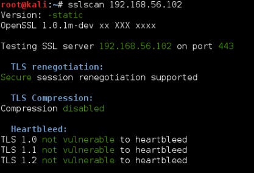
    
    输出的第一部分告诉我们服务器的配置，包含常见的安全错误配置：重协商、压缩和 Heartbleed，它是最近在一些 TLS 实现中发现的漏洞。这里，一切看起来都很好。
    
    
    
    在第二部分中，SSLScan 会展示服务器接受的加密方式。正如我们看到的那样，它支持 SSLv3 和一些例如 DES 的方式，它现在是不安全的。它们以红色文字展示，黄色文字代表中等强度的加密。
    
    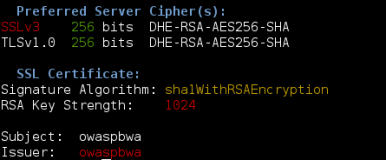
    
    最后，我们看到了首选的加密方式，如果客户端支持它，服务器会尝试用于通信。最终，服务器会使用有关证书的信息。我们可以看到，它将中等强度的算法用于签名，并使用 RSA 弱密钥。密钥是弱的，因为他只有 1024 位的长度，安全标准推荐至少 2048 位。
    
### 工作原理

SSLScan 通过创建多个到 HTTPS 的链接来工作，并尝试不同的加密方式和客户端配置来测试它接受什么。

当浏览器链接到使用 HTTPS 的服务器时，它们交换有关浏览器可以使用什么以及服务器支持什么的信息。之后它们在使用高度复杂的算法上达成一致。如果配置不当的 HTTPS 服务器上出现了 MITM 攻击，攻击者就可以通过声称客户端值支持弱加密算法来欺骗服务器，假如是 SSLv2 上的 56 位 DES。之后攻击者会拦截使用该算法加密的通信，通信可能会在几天或几小时之内使用现代计算机破解。

### 更多

就像我们之前提到的那样，SSLScan 能够检测 Heartbleed，这是一个最近在 OpenSSL 实现中发现的有趣漏洞。 

Heartbleed 在 2014 年四月被发现。它由一个缓冲区导致，多于允许的数据可以从内存中读出，这是 OpenSSL TLS 中的情况。

实际上，Heartbleed 可以在任何未装补丁的支持 TLS 的 OpenSSL （1.0.1 到 1.0.1f 之间）服务器上利用。它从服务器内存中读取 64 KB 的纯文本数据，这能够重复执行，服务器上不会留下任何踪迹或日志。这意味着攻击者可以从服务器读取纯文本信息，包括服务器的的私钥或者加密正是，会话 Cookie 或 HTTPS 请求会包含用户的密码或其它敏感信息。更多 Heartbleed 的信息请见维基百科：<https://en.wikipedia.org/wiki/ Heartbleed>。

### 另见

SSLScan 并不是唯一从 SSL/TLS 获取加密信息的攻击。Kali 中也有另一个工具叫做 SSLyze 可以用作替代，并且有时候会提供额外信息给攻击者。

```
sslyze --regular www.example.com 
```

SSL/TLS 信息也可以通过 OpenSSL 命令获得：

```
openssl s_client -connect www2.example.com:443
```

## 4.10 查找文件包含

文件包含漏洞出现在开发者使用请求参数的时候，在服务端的代码中，参数可以被用户修改来动态选择加载或包含哪个页面。如果服务器执行了所包含的文件，这种漏洞可能导致整个系统的沦陷。

这个秘籍中，我们会测试 Web 应用来发现是否含有文件包含漏洞。

### 操作步骤

1.  登录 DVWA 并访问`File Inclusion`。

2.  我们需要编辑 GET 参数来测试包含。让我们尝试`index.php`。

    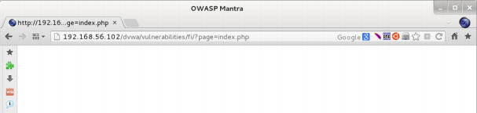

    看起来目录中没有`index.php`文件（或者它为空），也可能这意味着本地文件包含（LFI）可能出现。
    
3.  为了尝试 LFI，我们需要了解本地真正存在的文件名称。我们知道了 DVWA 根目录下存在`index.php`，所以我们对文件包含尝试目录遍历，将页面遍历设置为`../../index.php`。

    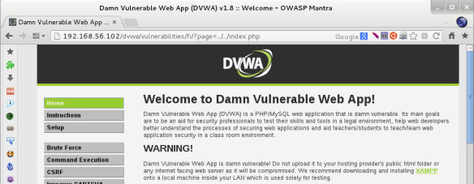
    
    这样我们就演示了 LFI 可能出现，并且路径遍历也可能出现（使用`../../`，我们就遍历了目录树）。
    
4.  下一步是尝试远程文件包含，包括储存在另一个服务器的我呢间，而不是本地文件，由于我们的测试虚拟机并没有连接互联网（或者它不应该联网，出于安全因素）。我们尝试带有完整 URL 的本地文件，就像它来自另一个服务器那样。我们也会尝试包含 Vicnum 的主页`?page=http://192.168.56.102/vicnum/index.html`，通过提供页面的 URL 作为参数，就像下面这样：

    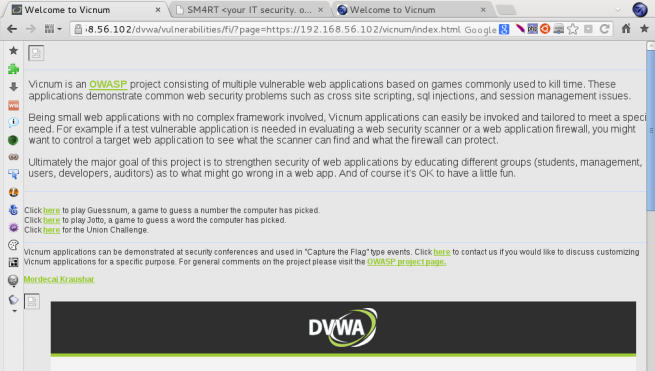
    
    我们能够通过提供完整 URL 使应用加载页面，这意味着我们可以包含远程文件，因此，存在远程文件包含（RFI）。如果被包含文件含有服务端可执行代码（例如 PHP），这种代码会被服务端执行。因此，攻击者可以执行远程命令，这样的话，整个系统很可能沦陷。
    
### 工作原理

如果我们使用 DVWA 的`View Source`按钮，我们可以看到服务端代码是：

```php
<?php 
$file = $_GET['page']; //The page we wish to display 
?>
```

这意味着`page`变量的值直接传给了文件名称，之后它被包含在代码中。这样，我们可以在服务端包含和执行任何我们想要的 PHP 或 HTML 文件，只要它可以通过互联网访问。存在 RFI 漏洞的情况下，服务器一定会在配置文件中打开`allow_url_fopen`和`allow_url_include`。否则它只能含有本地文件包含，如果文件包含漏洞存在的话。

### 更多

我们也可以使用本地文件包含来显示主机操作系统的相关文件。例如，试着包含`../../../../../../etc/passwd `，之后你就会得到系统用户和它们的主目录，以及默认 shell 的列表。

## 4.11 识别 POODLE 漏洞

就像上一章提到的那样，使用 SSLScan 获得 HTTPS 参数在一些条件下是可能的，尤其是中间人攻击者降级用于加密通信的安全协议和加密算法的时候。

POODLE 攻击使用这种条件来将 TLS 通信降级为 SSLv3 并强制使用易于被攻破的加密算法（CBC）。

这个秘籍中，我们会使用 Nmap 脚本来检测这种漏洞在测试服务器上是否存在。

### 准备

我们需要安装 Nmap 并下载特定为检测此漏洞而编写的脚本。

1.  访问` http://nmap.org/nsedoc/scripts/ssl-poodle.html`。

2.  下载` ssl-poodle.nse`文件。

3.  假设它下载到了你的 Kali 中的`/root/Downloads`中。下载打开终端并将它复制到 Nmap 的脚本目录中：

    ```
    cp /root/Downloads/ssl-poodle.nse /usr/share/nmap/scripts/
    ```
    
### 操作步骤

一旦你安装了脚本，执行下列步骤：

1.  打开终端并运行：

    ```
    nmap --script ssl-poodle -sV -p 443 192.168.56.102
    ```
    
    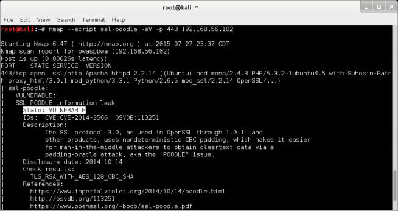

    
    我们告诉了 Nmap 要扫描`192.168.56.102`（我们的 vulnerable_vm）的 443 端口，识别服务版本并在它上面执行 ssl-poodle 脚本。一次你，我们可以断定，服务器有漏洞，因为它允许 使用` TLS_RSA_WITH_ AES_128_CBC_SHA`加密算法的 SSLv3 。
    
### 工作原理

我们下载的 Nmap 脚本和测试服务器建立了安全通信，并判断他是否支持 SSLv3 上的 CBC 加密算法。如果支持，它就存在漏洞。漏洞会导致任何拦截的信息都能被攻击者在很短的时间内解密。

### 另见

为了更好理解这个攻击，你可以查看一些这个加密实现最基本的解释。

+   Möller, Duong, and Kotowicz, This POODLE Bites: Exploiting the SSL 3.0 Fallback, https://www.openssl.org/~bodo/ssl-poodle.pdf 
+   https://en.wikipedia.org/wiki/Padding_oracle_attack 
+   https://en.wikipedia.org/wiki/Padding_%28cryptography%29#Block_cipher_mode_of_operation
