# 第五章 自动化扫描

> 作者：Gilberto Najera-Gutierrez

> 译者：[飞龙](https://github.com/)

> 协议：[CC BY-NC-SA 4.0](http://creativecommons.org/licenses/by-nc-sa/4.0/)

## 简介

几乎每个渗透测试项目都需要遵循严格的日程，多数由客户的需求或开发交谈日期决定。对于渗透测试者，拥有一种工具，它可以在很短的时间内执行单个应用上的多个测试，来尽可能在排期内识别最多漏洞很有帮助。自动化漏洞扫描器就是完成这种任务的工具，它们也用于发现替代的利用，或者确保渗透测试中不会遗漏了明显的事情。

Kali 包含一些针对 Web 应用或特定 Web 漏洞的漏洞扫描器。这一章中，我们会涉及到一些在渗透测试者和安全研究员中最广泛使用工具。

## 5.1 使用 Nikto 扫描

每个测试者的工具库中必定含有的工具就是 Nikto，它可能是世界上使用最广泛的自由扫描器。就像它的网站（<https://cirt.net/Nikto2>）上所说的那样：

> Nikto 是开源（GPL）的 Web 服务器扫描器，它对 Web 服务器执行综合扫描，包含超过 6700 个潜在的危险文件或程序，检查超过 1250 个服务器的过期版本，以及超过 270 个服务器上的特定问题。它也会检查服务器配置项，例如多个首页文件的存在，HTTP 服务器选项，也会尝试识别安装的 Web 服务器和软件。扫描的项目和插件也会经常更新，并可以自动更新。

这个秘籍中，我们会使用 Nikto 来搜索 Web 服务器中的漏洞并分析结果、

### 操作步骤

1.  Nikto 是个命令行工具，所以我们打开终端。

2.  我们会扫描 Peruggia 漏洞应用，并导出结果到 HTML 报告：

    ```
    nikto -h http://192.168.56.102/peruggia/ -o result.html
    ```
    
    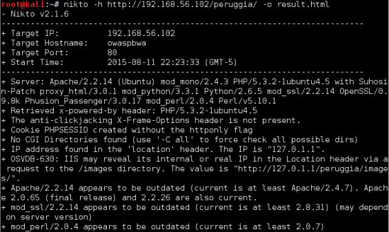
    
    `-h`选项告诉 Nikto 扫描哪个主机，`-o`选项告诉在哪里存放输出，文件的扩展名决定了接受的格式。这里，我们使用`.html`来获得 HTML 格式的结果报告。输出也可以以 CSV、TXT 或 XML 格式。
    
3.  它需要一些时间来完成扫描。完成之后，我么可以打开`result.html`文件：

    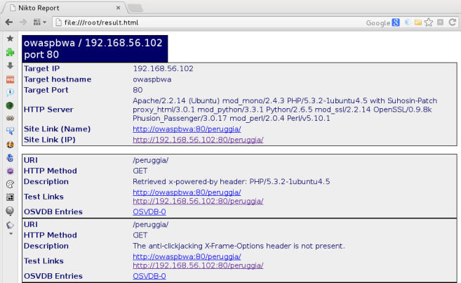
    
### 工作原理

这个秘籍中，我们使用 Nikto 来扫描应用并生成 HTML 报告。这个工具拥有一些更多的选项，用于执行特定扫描或生成特定输出格式。一些最实用的选项是：

+   `-H`：这会显示 Nikto 的帮助。

+   `-config <file>`：在扫描中用自定义的配置文件。

+   `-update`：更新插件数据库。

+   `-Format <format>`：这定义了输出格式，可以为CSV、HTML、NBE（Nessus）、SQL、TXT 或 XML。例如 CSV、XML 和 NBE 的格式在我们打算将其用于其它工具的输入时非常实用。

+   `-evasion <techique>`：这使用一些编码技巧来帮助避免 Web 应用防火墙和入侵检测系统的检测。

+   `-list-plugins`：查看可用的测试插件。

+   `-Plugins <plugins>`：选择在扫描中使用哪个插件（默认为全部）。

+   `-port <port number>`：如果服务器使用非标准端口（80，443），我们可能会以这个选项来使用 Nikto。

## 5.2 使用 Wapiti 发现漏洞

Wapiti 是另一个基于终端的 Web 漏洞扫描器，它发送 GET 和 POST 请求给目标站点，来寻找下列漏洞（<http://wapiti. sourceforge.net/>）：

+   文件泄露

+   数据库注入

+   XSS

+   命令执行检测

+   CRLF 注入

+   XXE（XML 外部实体）注入

+   已知潜在危险文件的使用

+   可被绕过的`.htaccess `弱配置

+   提供敏感信息的备份文件（源码泄露）

这个秘籍中，我们使用 Wapiti 来发现我们的测试应用上的漏洞，并生成扫描报告。

### 操作步骤

1.  我们可以从终端窗口打开 Wapiti，例如：

    ```
    wapiti http://192.168.56.102/peruggia/ -o wapiti_result -f html -m "-blindsql"
    ```
    
    我们会扫描 vulnerable_vm 中的 Peruggia 应用，将输出保存为 HTML 格式，保存到` wapiti_result`目录中，并跳过 SQL 盲注检测。
    
2.  如果我们打开了报告目录，和`index.html`文件，我们会看到一些这样的东西：

    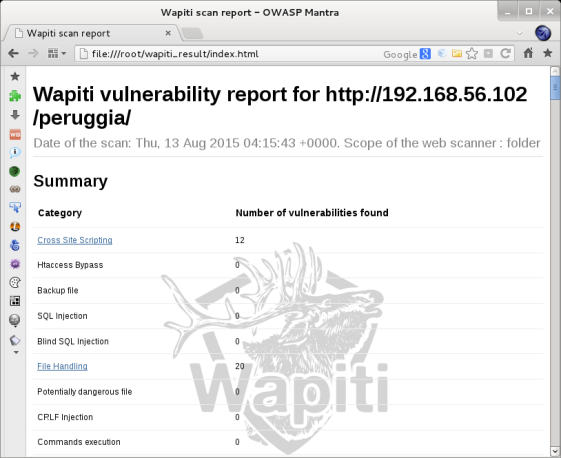

    这里，我们可以看到 Wapiti 发现了 12 个 XSS 和 20 个文件处理漏洞。
    
3.  现在点击` Cross Site Scripting`（跨站脚本）。

4.  选项某个漏洞并点击`HTTP Request`。我们选择第二个，选中并复制请求的 URL 部分。

    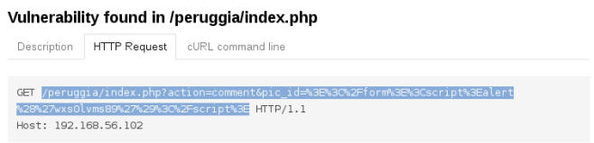
    
5.  现在，我们将 URL 粘贴到浏览器中，像这样：`http://192.168.56.102/ peruggia/index.php?action=comment&pic_id=%3E%3C%2Fform%3E%3Cscr ipt%3Ealert%28%27wxs0lvms89%27%29%3C%2Fscript%3E`。

    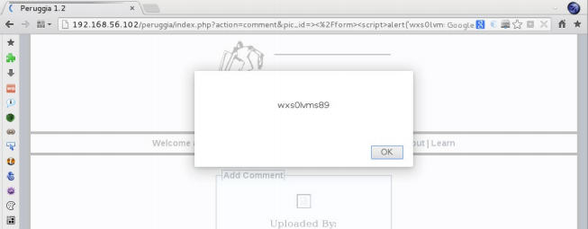
    
    我们确实发现了 XSS 漏洞。
    
### 工作原理

这个秘籍中，我们跳过了 SQL 盲注检测（`-m "-blindsql"`），因为这个应用存在这个漏洞。它会触发超时错误，使 Wapiti 在扫描完成之前关闭，因为 Wapiti 通过输入 `sleep()`命令来测试多次，直到服务器超过了超时门槛。同时，我们为输出选择了 HTML 格式（`-o html`），`wapiti_result`作为报告的目标目录，我们也可以选择其他格式，例如，JSON、OpenVAS、TXT 或 XML。

Wapiti 拥有一些其它的有趣的选项，它们是：

+   `-x <URL>`：从扫描中排除特定的 URL，对于登出和密码修改 URL 很实用。

+   `-i <file>`：从 XML 文件中恢复之前保存的扫描。文件名称是可选的，因为如果忽略的话 Wapiti 从`scan`文件夹中读取文件。

+   `-a <login%password>`：为 HTTP 登录使用特定的证书。

+   `--auth-method <method>`：为`-a`选项定义授权方式，可以为`basic`，`digest`，`kerberos` 或 `ntlm`。

+   `-s <URL>`：定义要扫描的 URL。

+   `-p <proxy_url>`：使用 HTTP 或 HTTPS 代理。

## 5.3 使用 OWASP ZAP 扫描漏洞

OWASP ZAP 是我们已经在这本书中使用过的工具，用于不同的任务，并且在它的众多特性中，包含了自动化的漏洞扫描器。它的使用和报告生成会在这个秘籍中涉及。

### 准备

在我们使用 OWASP ZAP 成功执行漏洞扫描之前，我们需要爬取站点：

1.  打开 OWASP ZAP 并配置浏览器将其用作代理。

2.  访问 `192.168.56.102/peruggia/`。

3.  遵循第三章“使用 ZAP 的蜘蛛”中的指南。

### 操作步骤

1.  访问 OWASP ZAP 的`Sites`面板，并右击`peruggia`文件夹。

2.  访问菜单中的`Attack | Active Scan`。

    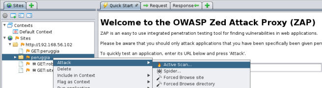

3.  新的窗口会弹出。这里，我们知道我们的应用和服务器使用哪种技术，所以，访问`Technology`标签页，并只勾选`MySQL`、`PostgreSQL`和`Linux`，以及`Apache`。

    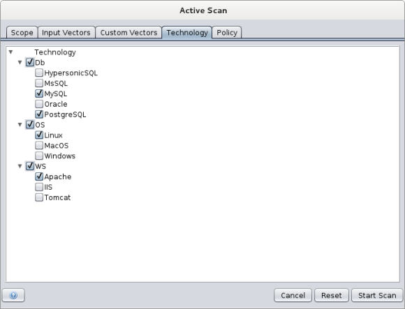
    
    这里我们可以配置我们的扫描器的`Scope`（从哪里开始扫描、在什么上下文中，以及其它）、`Input Vectors`（选项是否你打算测试 GET 和 POST 请求、协议头、Cookie和其它选项）、` Custom Vectors `（向原始请求中添加特定的字符或单词作为攻击向量）、`Technology `（要执行什么技术特定的测试）、以及`Policy`（为特定测试选项配置参数）。
    
4.  点击`Start Scan`。

5.  `Active Scan `标签页会出现在面板顶部，并且所有请求都会出现在那里。当扫描完成时，我们可以在`ALerts`标签页中检查结果。

    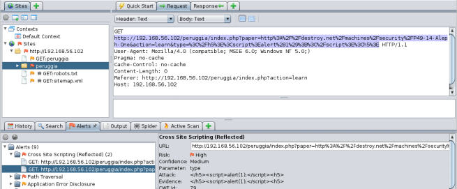
    
6.  如果我们选项某个警告，我们可以查看生成的请求，以及从服务器获得的响应。这允许我们分析攻击并判断是否是真正的漏洞，或者是误报。我们也可以使用这个信息来模糊测试，在浏览器中重放这个请求，或者深入挖掘以利用。为了生成 HTML 报告，就像前一个工具那样，在主菜单中访问`Report`之后选择` Generate HTML Report....`。

7.  新的对话框会询问文件名和位置。例如，设置`zap_result. html`并且在完成时打开文件：

    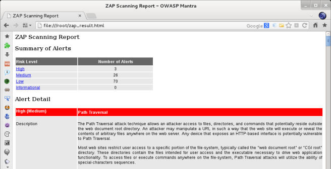
    
### 工作原理

OWASP ZAP 能够执行主动和被动漏洞扫描。被动扫描是 OWASP ZAP 在我们浏览过、发送数据和点击链接程中进行的非入侵测试。主动测试涉及对每个表单变量或请求值使用多种攻击字符串，以便检测服务器的响应是否带有我们叫做“脆弱行为”的东西。

OWASP ZAP 使用多种技术生成测试字串，它对于首次识别目标所使用的技术非常实用，以便优化我们的扫描并减少被检测到或导致服务崩溃的可能。

这个工具的另一个有趣特性是，我们可以产生于漏洞检测中的请求，而且它的相应响应在检测的时候会位于相同窗口中。这允许我们快读判断它是真正的漏洞还是误报，以及是否要开发我们的漏洞证明（POC）还是开始利用。

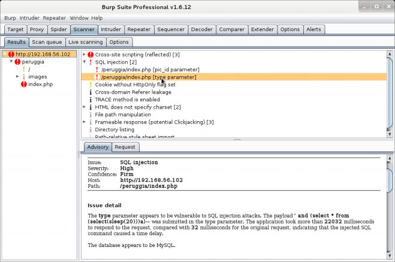

### 更多

我们已经谈论到 Burp Suite。Kali 只包含了免费版本，它没有主动和被动扫描特性。强烈推荐你获得 Burp Suite 的专业版许可证，因为它拥有实用特性和免费版之上的改进，例如主动和被动漏洞扫描。

被动漏洞扫描在我们使用 Burp Suite 作为浏览器的代理，并浏览网页时发生。Burp 会分析所有请求和响应，同时查找对应已知漏洞的模式。

在主动扫描中，Burp 会发送特定的请求给服务器并检查响应来查看是否对应一些漏洞模式。这些请求是特殊构造的，用于触发带有漏洞的应用的特定行为。

## 5.4 使用 w3af 扫描

w3af 支持应用审计和攻击框架。它是开源的，基于 Python 的 Web 漏洞扫描器。它拥有 GUI 和命令行界面，都带有相同的功能。这个秘籍中，我们会使用 w3af 的 GUI 配置扫描和报告选项来执行扫描。

### 操作步骤

1.  为了启动 w3af 我们可以从应用菜单栏选择它，通过浏览`Applications | 03 Web Application Analysis | w3af`，或者从终端中：

    ```
    w3af_gui
    ```
    
2.  在`Profiles `部分中，我们选择`full_audit`。

3.  在插件部分中，访问`crawl`并选择` web_spider `（已经选择的项目）。

4.  我们不打算让扫描器测试所有服务器，而是我们让它测试应用。在插件部分中，选中`only_forward`选项并点击`Save`。

    
    
5.  现在，我们会告诉 w3af 在完成时生成 HTML 报告。访问`output `插件并选中`html_file`。

6.  为了选择文件名称和保存报告的位置，修改`output_file`选项。这里我们会指定根目录下的`w3af_report.html`，点击`Save`。

    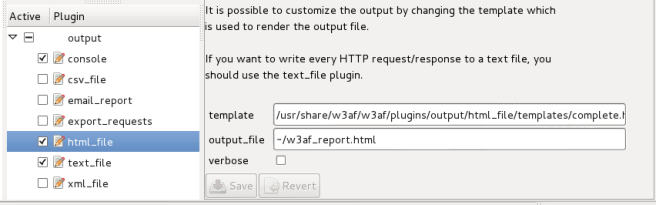
    
7.  现在在`Target`文本框中，输入打算测试的 URL，这里是`http://192.168.56.102/WackoPicko/`，并点击`Start`。

    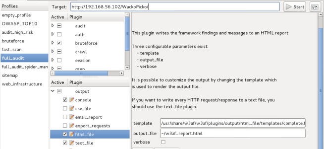

8.  日志标签页会获得焦点，我们能够看到扫描的进程。我们需要等待它完成。

9.  完成之后，切换到`Results`标签页，像这样：

    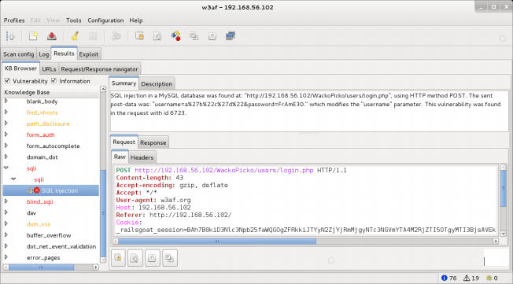
    
0.  为了查看详细的报告，在浏览器中打开`w3af_report.html`HTML 文件。

    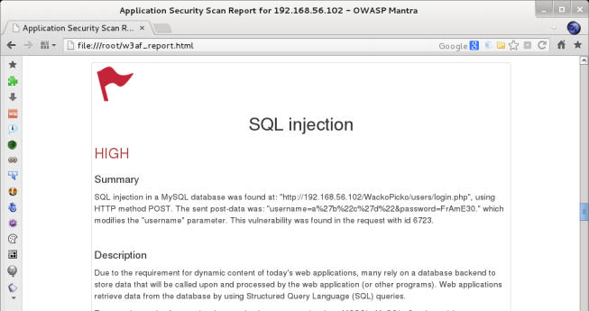


### 工作原理

w3af 使用配置文件来简化为扫描选择插件的任务，例如，我们可以定义只含有 SQL 注入的配置文件，它测试应用的 SQL 注入，不干其他的事情。` full_audit `配置使用一些插件，它们执行爬虫测试、提取可以用作密码的单词列表、测试大多数相关的 Web 漏洞，例如 XSS、SQLi、文件包含、目录遍历以及其它。我们修改了`web_spider`插件来前向爬取，以便我们可以专注于打算测试的应用，避免扫描到其它应用。我们也修改了输出插件来生成 HTML 报告，而不是控制台输出和文本文件。

w3af 也拥有一些工具，例如拦截代理、模糊测试器、文本编解码器、以及请求导出器，它可以将原始的请求转换为多种语言的源代码。

### 更多

w3af 的 GUI 有时会不稳定。在它崩溃以及不能完成扫描的情况下，它的命令行界面可以提供相同的功能。例如，为了执行我们刚才执行的相同扫描，我们需要在终端中做下列事情：

```
w3af_console 
profiles
use full_audit 
back 
plugins 
output config html_file 
set output_file /root/w3af_report.html 
save 
back 
crawl config web_spider 
set only_forward True 
save 
back 
back 
target 
set target http://192.168.56.102/WackoPicko/ 
save 
back 
start
```

## 5.5 使用 Vega 扫描器

Vega 是由加拿大公司 Subgraph 制作的 Web 漏洞扫描器，作为开源工具分发。除了是扫描器之外，它也可以用作拦截代理，以及在我们浏览器目标站点时扫描。

这个秘籍中，我们会使用 Vega 来发现 Web 漏洞。

### 操作步骤

1.  从应用菜单中选择它，访问`Applications | Kali Linux | Web Applications | Web Vulnerability Scanners | vega`，或者通过终端来打开 Vega：

    ```
    vega
    ```
    
2.  点击“开始新扫描“按钮。

3.  新的对话框会弹出。在标为`Enter a base URI for scan`的输入框中，输入`http://192.168.56.102/WackoPicko`来扫描应用。

    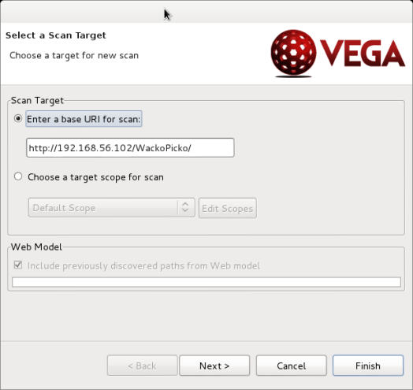
    
4.  点击`Next`。这里我们可以选择在应用上运行那个模块。让我们保持默认。

    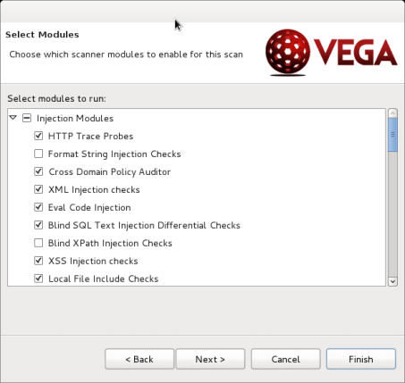

5.  点击`Finish`来开始扫描。

    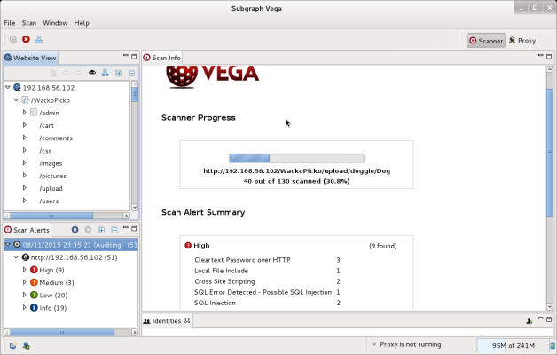
    
6.  当扫描完成时，我们可以通过访问左边的`Scan Alerts `树来检查结果。漏洞详情会在右边的面板中展示，像这样：

    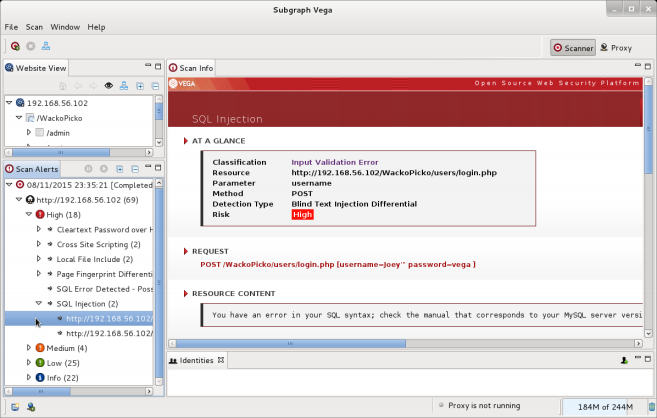
    
### 工作原理

Vega 的工作方式是首先爬取我们指定为目标的 URL，识别表单和其它可能的数据输入，例如 Cookie 或请求头。一旦找到了它们，Vega 尝试不同的输入，通过分析响应并将它们与已知漏洞模式匹配来识别漏洞。

在 Vega 中，我们可以扫描单个站点或范围内的一组站点。我们可以通过选择在扫描中使用的模块，来选择要进行哪种测试。同样，我们可以使用身份（预保存的用户/密码组合）或者会话 Cookie来为站点认证，并且从测试中排除一些参数。

作为重要的缺陷，它并没有报告生成或数据导出特性。所以我们需要在 Vega GUI 中查看所有的漏洞描述和详情。

## 5.6 使用 Metasploit 的 Wmap 发现 Web 漏洞

Wmap 本身并不是漏洞扫描器，他是个 Metasploit 模块，使用所有框架中的 Web 漏洞和服务器相关的模块，并使它们协调加载和对目标服务器执行。它的结果并不会导出为报告，但是会作为 Metasploit 数据库中的条目。

这个秘籍中，我们会使用 Wmap 来寻找 vulnerable_vm 中的漏洞，并使用 Metasploit 命令行工具来检查结果。

### 准备

在我们运行 Metasploit 的控制台之前，我们需要启动 所连接的数据库服务器，以便保存我们生成的结果：

```
service postgresql start
```

### 操作步骤

1.  启动终端并运行 Metasploit 控制台：

    ```
    msfconsole 
    ```
    
2.  加载完成后，加载 Wmap 模块：

    ```
    load wmap 
    ```
    
3.  现在，我们向 Wamp 中添加站点：

    ```
    wmap_sites -a http://192.168.56.102/WackoPicko/ 
    ```
    
4.  如果我们打算查看注册的站点：

    ```
    wmap_sites -l 
    ```
    
5.  现在我们将这个站点设为扫描目标：

    ```
    wmap_targets -d 0 
    ```
    
6.  如果我们打算插件所选目标，我们可以使用：

    ```
    wmap_targets -l 
    ```
    
    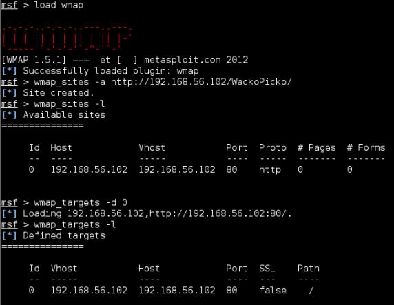
    
7.  现在，我们执行测试：

    ```
    wmap_run -e
    ```
    
    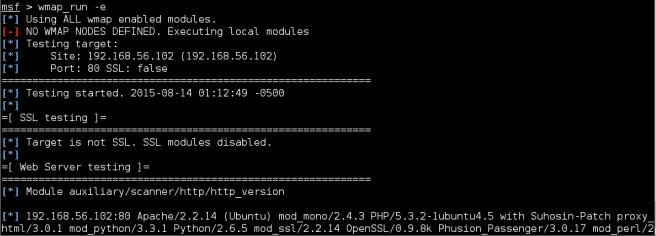
    
8.  我们需要使用 Metasploit 的命令来检查记录的漏洞：

    ```
    vulns 
    wmap_vulns
    ```
    
    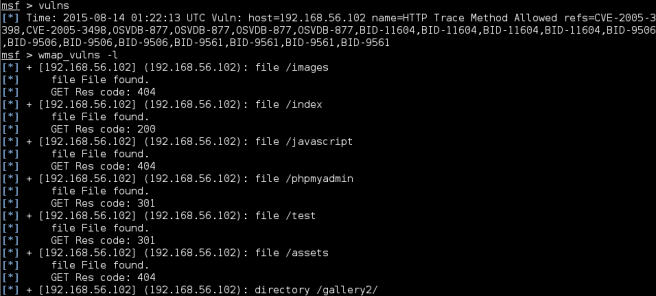
    
### 工作原理

Wmap 使用 Metasploit 的模块来扫描目标应用和服务器上的漏洞。它从 Metasploit 的数据库和模块中获取站点信息，并将结果发送到数据库中。这个集成的一个非常实用的层面是，如果我们执行多个服务器上的渗透测试，并且在测试中使用 Metasploit，Wmap 会自动获得所有 Web 服务器的 IP 地址，和已知 URL，并将它们集成为站点，以便当我们打算执行 Web 评估时，我们只需要从站点列表中选择目标。

在执行`wmap_run`的时候，我们可以选择要执行哪个模块。通过`-m`选项和正则表达式。例如，下面的命令行会开启所有模块，除了包含`dos`的模块，这意味着没有拒绝服务测试：

```
wmap_run -m ^((?!dos).)*$ 
```

另一个实用的选项是`-p`。它允许我们通过正则表达式选择我们打算测试的路径，例如，在下一个命令中，我们会检查所有包含单词`login`的 URL。

```
wmap_run -p ^.*(login).*$
```

最后，如果我们打算导出我们的扫描结果，我们总是可以使用 Metasploit 的数据库特性。例如，在 MSF 控制台中使用下列命令来将整个数据库导出为 XML 文件。

```
db_export -f xml /root/database.xml
```
